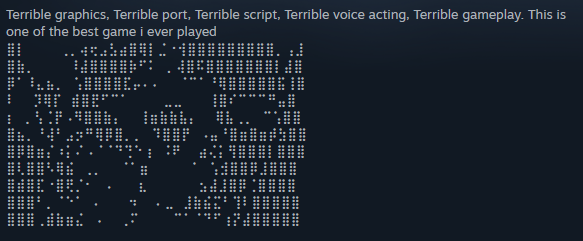

# analysis pipeline


**Note**: reviews.csv is too large to upload to github, but using the
data which is uploaded and the “data exploration” file, if you execute
the write_csv chunk, you should be able to recreate it just fine. You
may have to adjust the file path to read in for this one.

``` r
reviews_df <- read_csv("../private/reviews.csv", show_col_types = FALSE)
reviews_df
```

    # A tibble: 191,109 × 10
       review_id language date     review_type purchased score upvotes review engtxt
           <dbl> <chr>    <chr>    <chr>       <chr>     <dbl>   <dbl> <chr>  <chr> 
     1 205434212 english  2025.08… ✅          ❌            0       1 "The … "The …
     2 205407336 english  2025.08… ❌          ❌            0       0 "Game… "Game…
     3 205265837 english  2025.08… ❌          ✅            0       0 "So, … "So, …
     4 205236599 english  2025.08… ✅          ❌            0       0 "Eeri… "Eeri…
     5 205099824 english  2025.08… ❌          ❌            0       1 "just… "just…
     6 205035565 english  2025.08… ❌          ✅            0       0 "This… "This…
     7 205004797 english  2025.08… ✅          ✅            0       0 "Abso… "Abso…
     8 204962454 english  2025.08… ✅          ✅            0       0 "Most… "Most…
     9 204909988 english  2025.08… ❌          ❌            0       0 "I en… "I en…
    10 204877346 english  2025.08… ❌          ✅            0       0 "Wish… "Wish…
    # ℹ 191,099 more rows
    # ℹ 1 more variable: steam_id <dbl>

``` r
# checking for 45 unique games
reviews_df |>
  distinct(steam_id)
```

    # A tibble: 45 × 1
       steam_id
          <dbl>
     1   239200
     2  1048640
     3  1308950
     4   946600
     5  2607330
     6  2940020
     7   246940
     8  1092660
     9   300160
    10   238870
    # ℹ 35 more rows

## Cleaning Up

``` r
reviews_df <- reviews_df |>
    mutate(review_type =  str_replace_all(review_type, 
                c("✅" = "POS",
                  "❌" = "NEG")))
```

Fix those pesky emoji columns (I’m going to ditch the “purchased” column
later on, so I didn’t bother)

``` r
reviews_df
```

    # A tibble: 191,109 × 10
       review_id language date     review_type purchased score upvotes review engtxt
           <dbl> <chr>    <chr>    <chr>       <chr>     <dbl>   <dbl> <chr>  <chr> 
     1 205434212 english  2025.08… POS         ❌            0       1 "The … "The …
     2 205407336 english  2025.08… NEG         ❌            0       0 "Game… "Game…
     3 205265837 english  2025.08… NEG         ✅            0       0 "So, … "So, …
     4 205236599 english  2025.08… POS         ❌            0       0 "Eeri… "Eeri…
     5 205099824 english  2025.08… NEG         ❌            0       1 "just… "just…
     6 205035565 english  2025.08… NEG         ✅            0       0 "This… "This…
     7 205004797 english  2025.08… POS         ✅            0       0 "Abso… "Abso…
     8 204962454 english  2025.08… POS         ✅            0       0 "Most… "Most…
     9 204909988 english  2025.08… NEG         ❌            0       0 "I en… "I en…
    10 204877346 english  2025.08… NEG         ✅            0       0 "Wish… "Wish…
    # ℹ 191,099 more rows
    # ℹ 1 more variable: steam_id <dbl>

``` r
diffrows <- reviews_df[reviews_df$review != reviews_df$engtxt, ]
diffrows
```

    # A tibble: 1,117 × 10
       review_id language date     review_type purchased score upvotes review engtxt
           <dbl> <chr>    <chr>    <chr>       <chr>     <dbl>   <dbl> <chr>  <chr> 
     1 204166566 english  2025.08… POS         ❌            0       0 7/10   45848 
     2        NA <NA>     <NA>     <NA>        <NA>         NA      NA <NA>   <NA>  
     3 196362582 english  2025.05… NEG         ✅            0       0 3/10   45726 
     4 194326563 english  2025.04… POS         ❌            0       0 5/10   45787 
     5 184768635 english  2025.00… POS         ❌            0       0 9/10   45910 
     6 168865908 english  2024.06… POS         ✅            0       0 9/10   45910 
     7 162686854 english  2024.03… NEG         ✅            0       0 1/5    45662 
     8 155991617 english  2024.00… NEG         ❌            0       1 3/10   45726 
     9        NA <NA>     <NA>     <NA>        <NA>         NA      NA <NA>   <NA>  
    10        NA <NA>     <NA>     <NA>        <NA>         NA      NA <NA>   <NA>  
    # ℹ 1,107 more rows
    # ℹ 1 more variable: steam_id <dbl>

The engtxt column is not actually different from the review column, (it
seems to auto translate review text in other languages to varying
degrees of success, but I don’t want to study translations). The only
difference among English reviews being conversions of any reviews that
just say “xx%” (100% being converted to 1) or anything with x/10 being
also converted to a string of numbers. Since it’s essentially the same
data, I’ll ditch the engtxt column and keep the review one.

Now for column decisions. I’ll keep review_id since it’s a unique value
for each different review.

I don’t know that the date column is extremely important. I might want
to look at how quickly games get reviews (are they concentrated at
release and fall off, or is it relatively steady? any spikes?) but I
will probably edit the column to a better format. Ditch the time, look
into whatever format works best in R.

I don’t think the purchased col is extremely important, it only marks if
a review writer has purchased the game or not, which is not key to any
of my analysis.

score and upvotes are based on user response to a comment. Users can
upvote for helpfulness of a review, or mark it as funny. I can’t find
data on how exactly the review score is calculated, but I don’t think
these two factors will play a huge role in what I’m looking to do.

``` r
#narrowing the df down to only the columns I want
reviews_df <- reviews_df |>
  select(review_id:review_type, review, steam_id)
reviews_df
```

    # A tibble: 191,109 × 6
       review_id language date             review_type review               steam_id
           <dbl> <chr>    <chr>            <chr>       <chr>                   <dbl>
     1 205434212 english  2025.08.29 02:05 POS         "The atmosphere and…   239200
     2 205407336 english  2025.08.28 19:32 NEG         "Gameplay is lackin…   239200
     3 205265837 english  2025.08.27 00:41 NEG         "So, if you are hop…   239200
     4 205236599 english  2025.08.26 17:29 POS         "Eerie suspenseful …   239200
     5 205099824 english  2025.08.24 14:25 NEG         "just play the 1st …   239200
     6 205035565 english  2025.08.23 19:31 NEG         "This game has good…   239200
     7 205004797 english  2025.08.23 08:34 POS         "Absolute Cinema"      239200
     8 204962454 english  2025.08.22 21:33 POS         "Mostly a walking s…   239200
     9 204909988 english  2025.08.22 03:01 NEG         "I enjoyed the game…   239200
    10 204877346 english  2025.08.21 19:11 NEG         "Wish I could love …   239200
    # ℹ 191,099 more rows

Now, I wanted to verify everything is correct. If every review ID is
unique and I didn’t accidentally duplicate anything, then piping the
review_id column into distinct() should be the exact same dimensions as
the full dataframe.

I had to run some fixes, but it’s all good now!

``` r
reviews_df |>
  distinct(review_id)
```

    # A tibble: 191,109 × 1
       review_id
           <dbl>
     1 205434212
     2 205407336
     3 205265837
     4 205236599
     5 205099824
     6 205035565
     7 205004797
     8 204962454
     9 204909988
    10 204877346
    # ℹ 191,099 more rows

## List of Goals

- adjust the date column (DONE)
- clean up the text of non text items (DONE)
- Word tokens and word count per review (IN PROGRESS)
- word types
- TTR

**Early Exploration**

- average review length
- most common words (with and without stop words)
- most common words for pos and for neg
- some stats (correlation) - length and review type, review and rating
  type, maybe some others
- TF-IDF

**Later Goals**

- build a classifier

## Date column

Date format as is: 2025.08.29 02:05

- remove timestamp
- reformat
- change column class

``` r
reviews_df <- reviews_df |>
  mutate(date = str_replace_all(date, "(\\d{4})\\.(\\d{2})\\.(\\d{2}).*", "\\1-\\2-\\3"))
reviews_df$date <- as.Date(reviews_df$date)  
  
reviews_df
```

    # A tibble: 191,109 × 6
       review_id language date       review_type review                     steam_id
           <dbl> <chr>    <date>     <chr>       <chr>                         <dbl>
     1 205434212 english  2025-08-29 POS         "The atmosphere and sound…   239200
     2 205407336 english  2025-08-28 NEG         "Gameplay is lacking, sto…   239200
     3 205265837 english  2025-08-27 NEG         "So, if you are hoping fo…   239200
     4 205236599 english  2025-08-26 POS         "Eerie suspenseful horror…   239200
     5 205099824 english  2025-08-24 NEG         "just play the 1st one"      239200
     6 205035565 english  2025-08-23 NEG         "This game has good lore …   239200
     7 205004797 english  2025-08-23 POS         "Absolute Cinema"            239200
     8 204962454 english  2025-08-22 POS         "Mostly a walking simulat…   239200
     9 204909988 english  2025-08-22 NEG         "I enjoyed the game as es…   239200
    10 204877346 english  2025-08-21 NEG         "Wish I could love this g…   239200
    # ℹ 191,099 more rows

## Text Cleaning

``` r
reviews_df |>
  select(review)
```

    # A tibble: 191,109 × 1
       review                                                                       
       <chr>                                                                        
     1 "The atmosphere and sound design are strong, but many core mechanics from Th…
     2 "Gameplay is lacking, story is nothing special. \nOverall meh."              
     3 "So, if you are hoping for an authentic Amnesia experience, this is going to…
     4 "Eerie suspenseful horror game which doesn't resemble other games of the ser…
     5 "just play the 1st one"                                                      
     6 "This game has good lore and scares but my main issue with this game is the …
     7 "Absolute Cinema"                                                            
     8 "Mostly a walking simulator, but there's a few puzzles. There's a few collec…
     9 "I enjoyed the game as essentially a creepy walking simulator with some ligh…
    10 "Wish I could love this game but it crashes at the end of the same level eve…
    # ℹ 191,099 more rows

``` r
reviews_df <- reviews_df |>
   mutate(review =  str_replace_all(review, 
                c("\n" = " ",
                  "\\(" = "",
                  "\\)" = "",
                  "https.*? " = "",
                  "https.*\\b" = "",
                  "http.*? " = "",
                  "http.*\\b" = "",
                  "\\b\\+\\b" = "",
                  " \\+ " = "",
                  "(\\w)/(\\w)" = "\\1 \\2",
                  "(\\w) / (\\w)" = "\\1 \\2",
                  "([a-z]{2,})\\.([a-z]{2,})" = "\\1 \\2",
                  "\\[.*?\\]" = "",
                  " ==+ " = "",
                  "⠸|⢹|⠣|⣛|⣣|⣁|⣖|⣭|⠃|⢻|⣧|⣽" = "",
                  "⣷|⣟|⢶|⢣|⠄|⡿|⣮|⣻|⣦|⢛|⠿|⢭|⠼|⢀" = "",
                  "⡉|⣶|⠘|⢿|⡠|⢆|⣳|⡵|⡅|⠙|⣼|⡄|⡧|⢇" = "",
                  "⣴|⣌|⢽|⠻|⡛|⣤|⡝|⣾|⠚|⣀|⠏|⡻|⢘|⠎" = "",
                  "⣝|⣸|⣰|⡆|⣱|⣡|⢟|⣯|⡟|⢠|⠑|⠛|⢸|⢯" = "",
                  "⢎|⣕|⡮|⠝|⡾|⡯|⠕|⡹|⡂|⢈|⠟|⠢|⣎" = "",
                  "⡪|⡱|⢔|⡑|⢊|⢊|⠠|⠡|⠈|⡌|⠪|⣺|⡽" = "",
                  "⣗|⢉|⢄|⣐|⢂|⢐|⡔|⡀|⠁|⢑|⢨|⡁" = "",
                  "⢮|⣆|⠐|⣫|⢷|⢮|⢗|⢪|⣬|⢜|⢾|⣞" = "",
                  "⢗|⠥|⠨|⢪|⠂|⣬|⡗|⠧|⢞|⣪|⢱|⣬" = "",
                  "⡨|⡷|⢚|⠹|⡎|⢥|⠀|⡺|⢌|⡊|⡡|⠱|⠌" = "",
                  "⡲|⣹|⣑|⣨|⢳|⢡|⣜|⢵|⣔|⡸|⡭|⢃" = "",
                  "⢴|⢕|⡇|⢬|⢅|⣵|⠮|⢏|⡒|⡫|⡐|⡳" = "",
                  "⠯|⢢|⡩|⣃|⠔|⠜|⠇|⠅|⣇|⡰|⠰|⣅" = "",
                  "⡘|⡃|⢰|⡬|⡜|⢝|⢩|⡢|⡼|⣘|⠬|⠊|⢤" = "",
                  "⠫|⢼|⡕|⣲|⡏|⢺|⡈|⠤|⣥|⡥|⠶|⠽|⣥|⢦" = "",
                  "⠩|⡍|⠵|⣉|⣚|⠴|⠭|⣓|⡋|⠗|⣄|⣈|⠍" = "",
                  "⠺|⣢|⠷|⠋|⠾|⣠|⡴|⠆|⢖|⠞|⢲|⢁|⠉|⢋" = "",
                  "⢧|⣂|⢙|⠳|⣏|⡣|⡞|⠒|⡶|⣩|⠓|⣍|⠲|⡤" = "",
                  "⢫|⣙|⣊|⠖|⠦|⡙|⢓|⡦|⣒|⢒|⢍|⢒|⣋|⣋|⡖|⣿|⡚|⡓" = "",                  "▄|░|┌|┼|▐|▀|▓|╝|╔|▌|╗|╚|═|║|▒|Ñ|│|∩|╓|╫" = "",
                  "╙|╡|╠|⊙|▅|┤|●|▂|▃|◥|█" = "",
                

                  "──+" = "─",
                  "__+" = "_",
                  
                  "  +" = " ",
                  
                  "^ $" = ""
                  
                  )
                
                
                ))
```

Using str_view and str_replace I’m cleaning up the review text so I can
conduct some real analysis.

For the sake of processing text, I’m first removing any parenthesis
included. it could be interesting what gets put in a parenthetical
statement vs outside, but for pure analysis and vectorizing I don’t want
them.

There are some included kind of html(?) tags like \[b\] and \[/b\] or
\[h1\] etc. I want to get rid of those too.

Getting rid of /, sometimes it appears as word/word and others word /
word. Replacing it with a space and will later process to move extra
spaces down to one space - sometimes it appears in 7/10 or something.
I’m keeping those but I have to think about what to do with it. It also
depends on how the tokenizer handles it. If it tokenizes to \[7\] \[/\]
\[10\] I think that’s acceptable.

### Emojis

Question - what do to with emojis?

Sometimes they are used stylistically to split up reviews: 📚 Story /
Narrative, ⌛ Length, 🔁 Replayability

Other times functionally (this is about a game’s difficulty): 🔲 Too
easy ☑️ Casual-friendly 🔲 Balanced/Normal 🔲 Challenging 🔲 Brutal but
fair 🔲 Pure chaos (PvP focus)

Sometimes in place of words: At least one review, start to finish,
contains one item only - 💩 Another one looks like: This game is 💩 but
i still love it

There are some other quirks to the reviews:

- Some reviews also have no words and will just say “7/10” and nothing
  else, I’m leaving those as-is.

- There are a lot abbreviations. I’ve seen af, wtf, omg, lmao, etc etc.
  I’m leaving those as-is

- There are also emoticons in the pre-emoji style: :D, xD etc I even saw
  ° ͜ʖ ͡°, ﾉ◕ヮ◕ﾉ\*:･ﾟ✧ … they’re not NOT informative, so I’ll also
  leave those (unless I have to revisit later)

- LOTS of formatting choices people make for visual purposes. =====, ☑
  and ☐ (not as emojis). For the second I will leave them as they are
  and treat them almost as an emoji. For formatting, I’ll see what I can
  do about cutting down long lines of equals, hyphens, underscores, etc.

- Review art(?)



There are a number of reviews using ⣿ (and all the variations in the
replace text chunk above) to create a kind of ASCII art that can be
safely removed, it is not speech information at all.

- Finally, links links? Lots of people are linking to things in their
  reviews. I don’t want those.

In progress notes: I got rid of a bunch of ======= but there are still
some others…. but I can’t capture ==+ without also capturing a few
reviews that are just “8==D” which I GUESS counts as a valid review,
enough so that I don’t want to just erase parts of it.

## Tokenizing

Setting up the tokenizing here to see if there’s anything I need to
change in the text cleanup chunk above before I move onto an analysis
qmd

Because of the way unnest_tokens works, it spits out a DF with 11+
million rows, one token per row. My steps are: - new df with tokenized
reviews - merged df with those tokens combined into a list of tokens per
unique review ID - join the merged df with the original reviews df by
mapping onto the review ID

``` r
tokens_df <- reviews_df |>
  unnest_tokens(tokens, review, drop=FALSE, strip_punct=FALSE)

nrow(tokens_df)
```

    [1] 11059083

Manually removing punctuation from the tokenized words in order to
preserve emojis in other reviews.

``` r
rows_not_word <- tokens_df |>
  filter(!grepl("^[A-Za-z]+$", tokens))

rows_not_word
```

    # A tibble: 1,701,971 × 7
       review_id language date       review_type review              steam_id tokens
           <dbl> <chr>    <date>     <chr>       <chr>                  <dbl> <chr> 
     1 205434212 english  2025-08-29 POS         The atmosphere and…   239200 ,     
     2 205434212 english  2025-08-29 POS         The atmosphere and…   239200 ,     
     3 205434212 english  2025-08-29 POS         The atmosphere and…   239200 ,     
     4 205434212 english  2025-08-29 POS         The atmosphere and…   239200 ,     
     5 205434212 english  2025-08-29 POS         The atmosphere and…   239200 .     
     6 205434212 english  2025-08-29 POS         The atmosphere and…   239200 .     
     7 205434212 english  2025-08-29 POS         The atmosphere and…   239200 ,     
     8 205434212 english  2025-08-29 POS         The atmosphere and…   239200 -     
     9 205434212 english  2025-08-29 POS         The atmosphere and…   239200 ,     
    10 205434212 english  2025-08-29 POS         The atmosphere and…   239200 -     
    # ℹ 1,701,961 more rows

``` r
mystopwords <- tibble(tokens = c(",", "-", ".", "—", '“', '”', ":", "!", "?", "'", '"', ";", "&", ">", "–", "<", "~", "’", "´", "•", "◤", "◢", "▔", "┊", "╭", "╮", "┃", "╲", "◤‎", "┈", "▏", "▕",  "フ", "＞", "ミ＿x", "ﾉ", "￣", "二つ", "ヽ＿_ヽ_", "…", "╱", "`", "ノ", "ヽ", "|", "_", "＼", "{", "}",  "┈", "#", "◕", "ヮ", "◕", "･ﾟ", "＿＿", "‘", "*",  "=", "^", "♫", "⚪", "─", "►", "○", "₀", "₃", "₅", "₀", "ᴴᴰ", "⚙", "❐", "⊏", "⊐", "‚", "✓", "\\", "$", "£", "€", "+", "/", "=", "〃", "ᐠ", "｡", "ꞈ", "ᐟ⁠", "人", "^",  "_", "-", "〃"))
```

``` r
tokens_df <- anti_join(tokens_df, mystopwords, by="tokens")
```

The only punctuation I’ve kept is % because of its use in people
“grading” games in their reviews. I wanted to keep + for similar
reasons, but there were too many instances of it being used outside of
relevant contexts that I decided losing it overall would be fine.

``` r
merged_df <- tokens_df |>
  group_by(review_id) |>
  summarize(merged_text = paste(tokens, collapse = ", "))

nrow(merged_df)
```

    [1] 189873

``` r
reviews_df <- reviews_df |>
  left_join(merged_df)
```

    Joining with `by = join_by(review_id)`

``` r
reviews_df
```

    # A tibble: 191,109 × 7
       review_id language date       review_type review         steam_id merged_text
           <dbl> <chr>    <date>     <chr>       <chr>             <dbl> <chr>      
     1 205434212 english  2025-08-29 POS         The atmospher…   239200 the, atmos…
     2 205407336 english  2025-08-28 NEG         Gameplay is l…   239200 gameplay, …
     3 205265837 english  2025-08-27 NEG         So, if you ar…   239200 so, if, yo…
     4 205236599 english  2025-08-26 POS         Eerie suspens…   239200 eerie, sus…
     5 205099824 english  2025-08-24 NEG         just play the…   239200 just, play…
     6 205035565 english  2025-08-23 NEG         This game has…   239200 this, game…
     7 205004797 english  2025-08-23 POS         Absolute Cine…   239200 absolute, …
     8 204962454 english  2025-08-22 POS         Mostly a walk…   239200 mostly, a,…
     9 204909988 english  2025-08-22 NEG         I enjoyed the…   239200 i, enjoyed…
    10 204877346 english  2025-08-21 NEG         Wish I could …   239200 wish, i, c…
    # ℹ 191,099 more rows

I noticed that the merged df had a few less rows than the base reviews
df does, and have to investigate why that is.

``` r
colSums(is.na(reviews_df))
```

      review_id    language        date review_type      review    steam_id 
              0           0       21584           0         523           0 
    merged_text 
           1236 

``` r
reviews_df |>
  filter(if_any(merged_text, is.na))
```

    # A tibble: 1,236 × 7
       review_id language date       review_type review steam_id merged_text
           <dbl> <chr>    <date>     <chr>       <chr>     <dbl> <chr>      
     1 203871513 english  2025-08-08 POS         "."      239200 <NA>       
     2 187321610 english  2025-01-06 POS         ".,"     239200 <NA>       
     3 181709402 english  2024-11-03 POS         "."      239200 <NA>       
     4 152081120 english  2023-10-26 POS         "++"     239200 <NA>       
     5 123922695 english  2022-09-16 POS         ""       239200 <NA>       
     6 115778757 english  2022-04-21 NEG         ":"      239200 <NA>       
     7 111643211 english  2022-02-06 POS         "..."    239200 <NA>       
     8 109394107 english  2022-01-03 POS         "/"      239200 <NA>       
     9 107843020 english  NA         POS         "."      239200 <NA>       
    10  91673439 english  2021-04-09 POS         "?"      239200 <NA>       
    # ℹ 1,226 more rows

``` r
reviews_df <- reviews_df |>
  drop_na(merged_text)

nrow(reviews_df)
```

    [1] 189873

The removal of punctuation ended up cutting down on some rows. It saved
us our emojis but removed some reviews that I saw at least that were
just “???????”, just an emoticon, or “…..” etc. Some reviews had no
text, it turns out, which became an N/A once tokenized, and those have
been removed now as well.

## One more thing…

When I got started on my analysis notebook, I found some additional
cleaning up that I needed to do. This mostly was some odd unicode blank
spaces that were affecting some of my looks at tokens and types,
especially with emojis. I’m moving that here for the sake of
cleanliness.

``` r
reviews_df <- reviews_df |>
  #rename from the tokenized col from before
  rename(tokens = merged_text)

reviews_df
```

    # A tibble: 189,873 × 7
       review_id language date       review_type review              steam_id tokens
           <dbl> <chr>    <date>     <chr>       <chr>                  <dbl> <chr> 
     1 205434212 english  2025-08-29 POS         The atmosphere and…   239200 the, …
     2 205407336 english  2025-08-28 NEG         Gameplay is lackin…   239200 gamep…
     3 205265837 english  2025-08-27 NEG         So, if you are hop…   239200 so, i…
     4 205236599 english  2025-08-26 POS         Eerie suspenseful …   239200 eerie…
     5 205099824 english  2025-08-24 NEG         just play the 1st …   239200 just,…
     6 205035565 english  2025-08-23 NEG         This game has good…   239200 this,…
     7 205004797 english  2025-08-23 POS         Absolute Cinema       239200 absol…
     8 204962454 english  2025-08-22 POS         Mostly a walking s…   239200 mostl…
     9 204909988 english  2025-08-22 NEG         I enjoyed the game…   239200 i, en…
    10 204877346 english  2025-08-21 NEG         Wish I could love …   239200 wish,…
    # ℹ 189,863 more rows

## Write out reviews.csv

``` r
write_csv(reviews_df, file="../private/reviews_analyze.csv")
```

``` r
sessionInfo()
```

    R version 4.5.1 (2025-06-13 ucrt)
    Platform: x86_64-w64-mingw32/x64
    Running under: Windows 10 x64 (build 19045)

    Matrix products: default
      LAPACK version 3.12.1

    locale:
    [1] LC_COLLATE=English_United States.utf8 
    [2] LC_CTYPE=English_United States.utf8   
    [3] LC_MONETARY=English_United States.utf8
    [4] LC_NUMERIC=C                          
    [5] LC_TIME=English_United States.utf8    

    time zone: America/New_York
    tzcode source: internal

    attached base packages:
    [1] stats     graphics  grDevices utils     datasets  methods   base     

    other attached packages:
     [1] tidytext_0.4.3  lubridate_1.9.4 forcats_1.0.1   stringr_1.5.2  
     [5] dplyr_1.1.4     purrr_1.1.0     readr_2.1.5     tidyr_1.3.1    
     [9] tibble_3.3.0    ggplot2_4.0.0   tidyverse_2.0.0

    loaded via a namespace (and not attached):
     [1] janeaustenr_1.0.0  utf8_1.2.6         generics_0.1.4     stringi_1.8.7     
     [5] lattice_0.22-7     hms_1.1.3          digest_0.6.37      magrittr_2.0.4    
     [9] evaluate_1.0.5     grid_4.5.1         timechange_0.3.0   RColorBrewer_1.1-3
    [13] fastmap_1.2.0      jsonlite_2.0.0     Matrix_1.7-3       scales_1.4.0      
    [17] cli_3.6.5          crayon_1.5.3       rlang_1.1.6        tokenizers_0.3.0  
    [21] bit64_4.6.0-1      withr_3.0.2        yaml_2.3.10        parallel_4.5.1    
    [25] tools_4.5.1        tzdb_0.5.0         vctrs_0.6.5        R6_2.6.1          
    [29] lifecycle_1.0.4    bit_4.6.0          vroom_1.6.6        archive_1.1.12    
    [33] pkgconfig_2.0.3    pillar_1.11.1      gtable_0.3.6       glue_1.8.0        
    [37] Rcpp_1.1.0         xfun_0.53          tidyselect_1.2.1   rstudioapi_0.17.1 
    [41] knitr_1.50         dichromat_2.0-0.1  farver_2.1.2       htmltools_0.5.8.1 
    [45] SnowballC_0.7.1    rmarkdown_2.29     compiler_4.5.1     S7_0.2.0          
