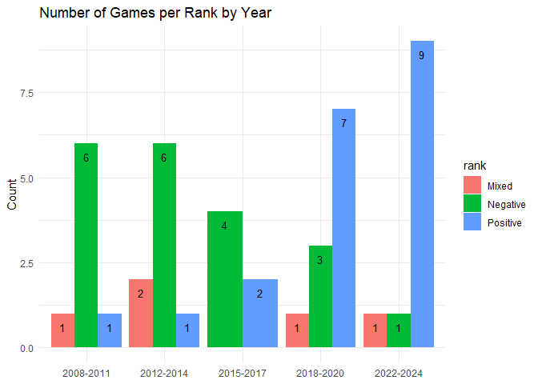
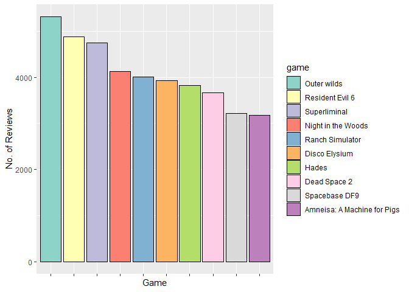
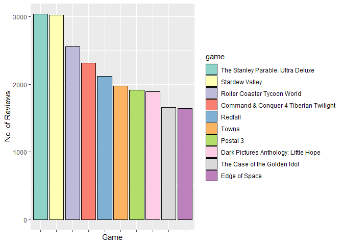
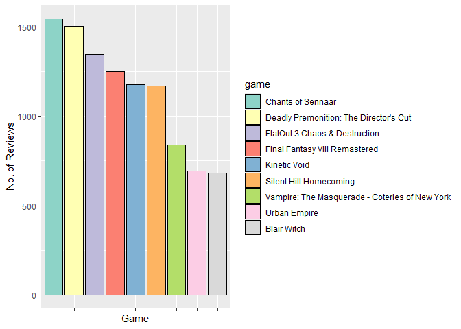
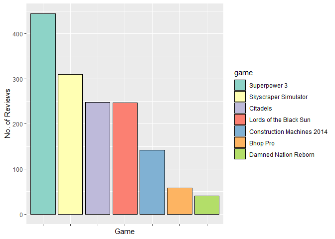
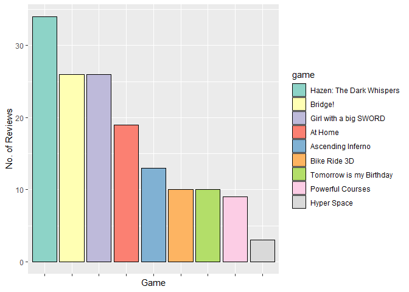
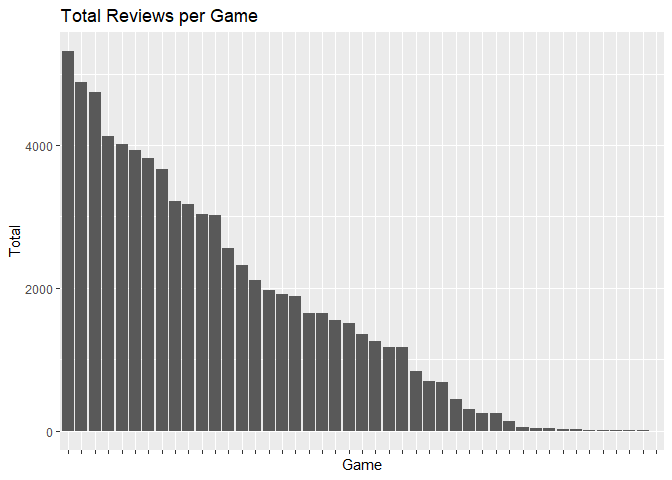
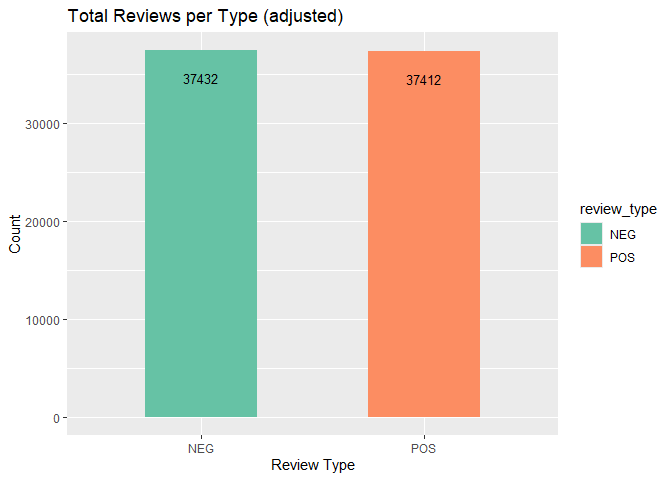
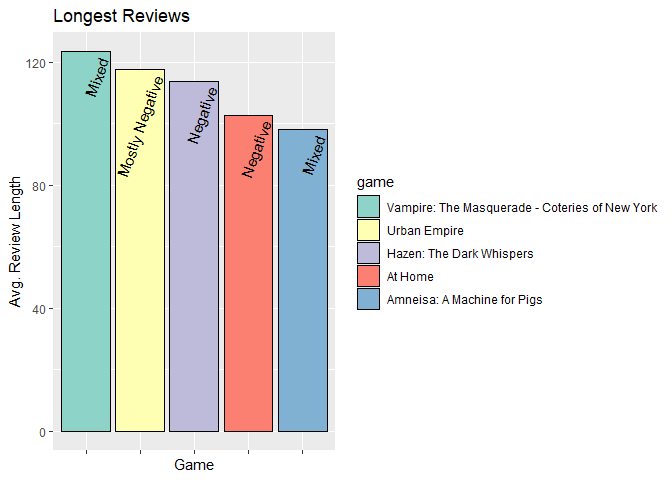
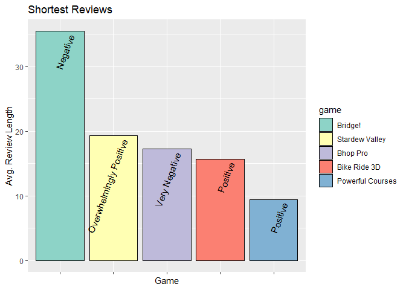

# 2-data-analysis


**Note**: Please run
[0-data-exploration](https://github.com/Data-Sci-2025/Steam-Reviews-Analysis/blob/main/data_processing/0-data-exploration.qmd)
and
[1-data-cleanup](https://github.com/Data-Sci-2025/Steam-Reviews-Analysis/blob/main/data_processing/1-data-cleanup.qmd)
first to create the version of the .csv file needed to start here.

## A note about the data

There are two main aspects of my data being analyzed in this file.

1.  review type

Reviews in Steam can either be positive or negative (indicated by a
thumbs up or thumbs down). I will often refer to review type in relation
to other variables. There are always only two categories this could be.

2.  game rank

Game ranks in Steam are a bit more complicated. There are nine total
ranks a game could fall into, Overwhelmingly Positive, Very Positive,
Positive, Mostly Positive, Mixed, and the mirrored version of the first
four for Negative games as well.

There isn’t an official source of the exact breakdown of how these ranks
are calculated, but people have worked out that it comes down to both
the ratio of positive and negative review types as well as total number
of reviews.

For example, a game with 3,000 99% positive reviews will still be ranked
lower than a game with 5,000 95% positive reviews. Or a game can be 100%
positive, but if it has fewer than 50 reviews, it will be stuck in the
“Positive” ranking. As far as I’ve understood, these calculations are
the same for negatively reviewed games. It appears that regardless of
number of reviews, if the ratio of positive/negative reviews is in the
40%-60% range, it will be considered “Mixed”.

I will, at times during my analysis, lump these game rankings together
into a simplified three tiers; positive, mixed, and negative. Just know,
that in these moments, the positive and negative options are referring
to four smaller categories grouped together for the sake of ease.

``` r
# reviews 
full_df <- read_csv("../private/reviews_analyze.csv", show_col_types = FALSE)

# game titles, ranks, etc, we'll need it later
games <- read_csv("../notes_and_info/0-gameinfo.csv", show_col_types = FALSE)
```

## Downsampling Data

In the data as I gathered it, positively reviewed games were quite over
represented in the data. Because many of the positively reviewed games
in the data are widely beloved games, they naturally have only gathered
more and more reviews with time, with a majority of those being positive
reviews.

The number of reviews (total and in English) at [this
table](https://github.com/Data-Sci-2025/Steam-Reviews-Analysis/blob/main/notes_and_info/0-gameinfo.csv)
were added manually by me using the total listing on the Steam App.
Those numbers are accurate as of the date I downloaded my reviews (shown
in my
[projnotes.md](https://github.com/Data-Sci-2025/Steam-Reviews-Analysis/blob/main/notes_and_info/projnotes.md)).
However the script I used to download the reviews would time out after a
certain point, and not every single review was downloaded.

The original numbers are shown here.

``` r
full_df |>
  group_by(steam_id) |>
  summarise(total = n()) |>
  arrange(desc(total))
```

    # A tibble: 45 × 2
       steam_id total
          <dbl> <int>
     1   753640 18607
     2  1049410 16078
     3   481510 14486
     4  1145360 14311
     5   632470 12465
     6    47780 12318
     7   413150 11358
     8  1703340 10527
     9   221040 10525
    10  1119730  9671
    # ℹ 35 more rows

``` r
full_df |>
  group_by(review_type) |>
  summarise(total = n())
```

    # A tibble: 2 × 2
      review_type  total
      <chr>        <int>
    1 NEG          37432
    2 POS         151866

My theory here just comes down to popularity. As a game releases and
players try it out and review it, it begins to migrate through the ranks
of either positive or negative. As new players find out about the game,
if it shows already that it’s being negatively reviewed, why would they
spend money to try it out themselves? I wouldn’t! On the other hand, if
players see that a game is getting positive reviews, they’re more likely
to try it and, in turn, also positively review it.

The negatively reviewed games were very likely largely forgotten to time
once they started the descent into the negative review rankings. After
an initial flood of bad reviews, feedback fell off.

So, there it is. Positively ranked games have overall more reviews than
negatively ranked games, and there are more positive reviews than
negative ones in my data as a result.

Because of this, we decided the best fit would be a stratified
downsampling of the total positive reviews. Positive reviews to be
randomly, but proportionally, cut down in total to be made more equal to
negatively reviewed games and as a result, more appropriately
comparable.

``` r
posreviews <-
  full_df |>
  filter(review_type=="POS")

negreviews<-
  full_df |>
  filter(review_type=="NEG")
```

``` r
# seed so randomly selected downsampled reviews will be the same
set.seed(1234)

# reviews to be analyzed, sampled proportionally by difference in neg & pos reviews per game
reviews_df <- posreviews |>
  slice_sample(prop=nrow(negreviews)/nrow(posreviews), by=steam_id)

reviews_df <- bind_rows(reviews_df, negreviews)

# a new df, much more manageable in size
reviews_df
```

    # A tibble: 74,844 × 7
       review_id language date       review_type review              steam_id tokens
           <dbl> <chr>    <date>     <chr>       <chr>                  <dbl> <chr> 
     1 105382110 english  2021-11-07 POS         It has a cool stor…   239200 it, h…
     2 139344896 english  2023-05-01 POS         Not as scary or in…   239200 not, …
     3  20463094 english  NA         POS         It is different fr…   239200 it, i…
     4 111691944 english  2022-02-06 POS         You cant even thro…   239200 you, …
     5  13978711 english  NA         POS         I really enjoyed M…   239200 i, re…
     6  41760508 english  2018-03-29 POS         pig                   239200 pig   
     7  11211035 english  2014-06-13 POS         I ALMOST PEED MYSE…   239200 i, al…
     8  18200629 english  2015-08-26 POS         The story is reall…   239200 the, …
     9  36856051 english  2017-10-23 POS         Its Alright, not t…   239200 its, …
    10  97148560 english  2021-07-08 POS         Fun and scary at t…   239200 fun, …
    # ℹ 74,834 more rows

``` r
#combine the reviews df and the game info df for all info needed
merged_games <- reviews_df |>
  left_join(games) 
```

    Joining with `by = join_by(steam_id)`

## Getting a Look at the Data

The data we’ll be looking at is game reviews for 45 games spread out
over 15 years from 2008 to 2024 (no games from 2021 are in the data). To
get a feel for what we’re looking at, let’s take a look.

``` r
simple_games <- games |>
  #simplify the 9 game ranks into three by combining all positives and negatives
  mutate(rank = str_replace_all(rank, "\\w+ (\\w)", "\\1")) |>
  mutate(year_range = cut(year, 
          breaks=c(0,2011,2014,2017,2020,2024),
          labels=c('2008-2011','2012-2014','2015-2017','2018-2020','2022-2024')))

ggplot(simple_games, aes(x = year_range, fill=rank)) +
      geom_bar(position="dodge") +
      labs(title = "Number of Games per Rank by Year",
           x = NULL,
           y = "Count") +
      geom_text(stat = "count", aes(label = after_stat(count)), size = 3.5, vjust = 2, hjust = 0.5, position = position_dodge(width=.9)) +
      theme_minimal()
```



As mentioned above, the positive and negative “ranks” here are 4 ranks
each combined. Are games getting better over time? This sample of 45
games seems to suggest it! That’s not something I want to conclude from
such a small sample size of all Steam games, but it’s an interesting
look here.

``` r
# merging full size reviews_df to games info
merged_games2 <- full_df |>
  left_join(games) 
```

    Joining with `by = join_by(steam_id)`

``` r
games_year <- merged_games |>
  mutate(year_range = cut(year, 
            breaks=c(0,2011,2014,2017,2020,2024),
            labels=c('2008-2011','2012-2014','2015-2017','2018-2020','2022-2024')))

ggplot(games_year, aes(x = year_range, fill=review_type)) +
      geom_bar(position="dodge") +
      labs(title = "Number of Reviews by Year (adjusted)",
           x = "Years",
           y = "Count") +
      theme_minimal()
```


``` r
games_year2 <- merged_games2 |>
  mutate(year_range = cut(year, 
            breaks=c(0,2011,2014,2017,2020,2024),
            labels=c('2008-2011','2012-2014','2015-2017','2018-2020','2022-2024')))

ggplot(games_year2, aes(x = year_range, fill=review_type)) +
      geom_bar(position="dodge") +
      labs(title = "Number of Reviews by Year (original)",
           x = "Years",
           y = "Count") +
      theme_minimal()
```


Again, these year divisions contain 8 games, 9 games, 5 games, 11 games,
and 12 games each. The number and ratio of negative and positive reviews
for games across 15 years seems to align with the chart above. In this
data, at least, games got more positive with time!

### Reviews per game

``` r
revcount_df <- merged_games2 |>
  group_by(game) |>
  summarise(total = n()) |>
  arrange(desc(total))
revcount_df
```

    # A tibble: 45 × 2
       game                              total
       <chr>                             <int>
     1 Outer wilds                       18607
     2 Superliminal                      16078
     3 Night in the Woods                14486
     4 Hades                             14311
     5 Disco Elysium                     12465
     6 Dead Space 2                      12318
     7 Stardew Valley                    11358
     8 The Stanley Parable: Ultra Deluxe 10527
     9 Resident Evil 6                   10525
    10 Ranch Simulator                    9671
    # ℹ 35 more rows

``` r
cut1 <- revcount_df |>
  slice(1:10) |>
  #reorder by total so that the plot legend is in the right order
  mutate(game = fct_reorder(game, total, .desc = TRUE))

cut2 <- revcount_df |>
  slice(11:20) |>
  mutate(game = fct_reorder(game, total, .desc = TRUE))

cut3 <- revcount_df |>
  slice(21:29) |>
  mutate(game = fct_reorder(game, total, .desc = TRUE))

cut4 <- revcount_df |>
  slice(30:36)|>
  mutate(game = fct_reorder(game, total, .desc = TRUE))

cut5 <- revcount_df |>
  slice(37:45) |>
  mutate(game = fct_reorder(game, total, .desc = TRUE))
```

``` r
ggplot(cut1, aes(x = reorder(game, -total), y=total, fill=game)) +
  geom_bar(stat='identity', color="black") + 
  scale_fill_brewer(palette = "Set3") +
  theme(axis.text.x = element_blank()) +
  labs(x="Game", y = "No. of Reviews")
```



``` r
ggplot(cut2, aes(x = reorder(game, -total), y=total, fill=game)) +
  geom_bar(stat='identity', color="black") + 
  scale_fill_brewer(palette = "Set3") +
  theme(axis.text.x = element_blank()) +
  labs(x="Game", y = "No. of Reviews")
```



``` r
ggplot(cut3, aes(x = reorder(game, -total), y=total, fill=game)) +
  geom_bar(stat='identity', color="black") + 
  scale_fill_brewer(palette = "Set3") +
  theme(axis.text.x = element_blank()) +
  labs(x="Game", y = "No. of Reviews")
```



``` r
ggplot(cut4, aes(x = reorder(game, -total), y=total, fill=game)) +
  geom_bar(stat='identity', color="black") + 
  scale_fill_brewer(palette = "Set3") +
  theme(axis.text.x = element_blank()) +
  labs(x="Game", y = "No. of Reviews")
```



``` r
ggplot(cut5, aes(x = reorder(game, -total), y=total, fill=game)) +
  geom_bar(stat='identity', color="black") + 
  scale_fill_brewer(palette = "Set3") +
  theme(axis.text.x = element_blank()) +
  labs(x="Game", y = "No. of Reviews")
```



Take care to note the y-axis and how it changes between plots. The games
with the fewest reviews are significantly less than the ones with the
most. This is because of how the “Positive” and “Negative” categories
are calculated, the cutoff point at those ranks is 50 reviews. Any more
than that and the game will migrate to a different rank.

Also please note that the numbers indicated here are not reflective of
the actual number of reviews as shown on Steam (documented
[here](https://github.com/Data-Sci-2025/Steam-Reviews-Analysis/blob/main/notes_and_info/0-gameinfo.csv)),
and only reflect the total number of reviews in *this* data set. The
script used to download would time out on some of the more reviewed
games.

Finally, I’ve mentioned before that it is the most positively reviewed
games that had the most total reviews total, and that is *mostly* true.
Resident Evil 6 is quite high in the total numbers of reviews per game,
but is still in the Mixed reviews ranking, lots of opinionated people
who can’t come to a consensus! Otherwise the top 10 in number of reviews
are high in the Steam ranks. The least reviewed games are, of course,
those in the plain Positive and Negative ranks, thanks to the limit in
those categories being up to 50 reviews.

Just to get a full scope of the scale (and why I split the data up like
I did above) here are all the totals in comparison.

``` r
ggplot(revcount_df, aes(x = reorder(game, -total), y=total)) +
  geom_bar(stat='identity') +
  theme(axis.text.x = element_blank()) +
  labs(x="Game", y="Total", title="Total Reviews per Game")
```



### Positive and Negative

How many reviews of each type are there?

``` r
ggplot(full_df, aes(x=review_type, fill=review_type )) + 
  geom_bar( width = 0.5) +
  scale_fill_brewer(palette = "Set2") +
  geom_text(stat = "count", aes(label = after_stat(count)), size = 3.5, vjust = 3, hjust = 0.5, position = "stack") +
  theme(legend.position="right") +
  labs(x="Review Type", y="Count", title="Total Reviews per Type (original)")
```


``` r
ggplot(reviews_df, aes(x=review_type, fill=review_type )) + 
  geom_bar( width = 0.5) +
  scale_fill_brewer(palette = "Set2") +
  geom_text(stat = "count", aes(label = after_stat(count)), size = 3.5, vjust = 3, hjust = 0.5, position = "stack") +
  theme(legend.position="right") +
  labs(x="Review Type", y="Count", title="Total Reviews per Type (adjusted)")
```



Let’s look at the actual count of reviews per game ranking, simplified
down to only positive, negative, and mixed for ease.

``` r
merged_games |>
  group_by(rank) |>
  #merging all varieties of pos/neg together by removing the first word per rank
  #very positive and overwhelmingly positive both just become positive etc
  mutate(rank = str_replace_all(rank, "\\w+ (\\w)", "\\1")) |>
  summarise(count = n())
```

    # A tibble: 3 × 2
      rank     count
      <chr>    <int>
    1 Mixed     8809
    2 Negative 18422
    3 Positive 47613

Even after adjusting, Positive ranked games are more reviewed than
Negative ones! Some of those games had a 99% ratio of positive reviews,
so even after being proportionally downsampled, there are a lot left!

## Word Count

``` r
reviews_df <- reviews_df |>
  mutate(word_count = str_count(tokens, '\\,')+1)

reviews_df
```

    # A tibble: 74,844 × 8
       review_id language date       review_type review   steam_id tokens word_count
           <dbl> <chr>    <date>     <chr>       <chr>       <dbl> <chr>       <dbl>
     1 105382110 english  2021-11-07 POS         It has …   239200 it, h…         96
     2 139344896 english  2023-05-01 POS         Not as …   239200 not, …         36
     3  20463094 english  NA         POS         It is d…   239200 it, i…         74
     4 111691944 english  2022-02-06 POS         You can…   239200 you, …         17
     5  13978711 english  NA         POS         I reall…   239200 i, re…        170
     6  41760508 english  2018-03-29 POS         pig        239200 pig             1
     7  11211035 english  2014-06-13 POS         I ALMOS…   239200 i, al…          9
     8  18200629 english  2015-08-26 POS         The sto…   239200 the, …        121
     9  36856051 english  2017-10-23 POS         Its Alr…   239200 its, …         18
    10  97148560 english  2021-07-08 POS         Fun and…   239200 fun, …         23
    # ℹ 74,834 more rows

### Review length

With word counts per review added, let’s take a look!

``` r
summary(reviews_df$word_count)
```

       Min. 1st Qu.  Median    Mean 3rd Qu.    Max. 
       1.00    7.00   22.00   61.75   64.00 2182.00 

So the average review (for the full data) is around 51/52 words long,
and the median 17 words. Adjusted, that shifts to an average of almost
62 words, and a median of 22. Because we adjusted specifically the
positive reviews, and a vast majority of the shortest reviews were all
positive, the average lengths are a bit higher.

Let’s look a little deeper.

``` r
reviews_df |>
  filter(word_count==1) |>
  group_by(review_type) |>
  summarise(total=n())
```

    # A tibble: 2 × 2
      review_type total
      <chr>       <int>
    1 NEG          1218
    2 POS          3065

``` r
reviews_df |>
  filter(word_count>1700) |>
  group_by(review_type) |>
  summarise(total=n())
```

    # A tibble: 1 × 2
      review_type total
      <chr>       <int>
    1 POS            17

``` r
reviews_df |>
  filter(word_count==1)
```

    # A tibble: 4,283 × 8
       review_id language date       review_type review   steam_id tokens word_count
           <dbl> <chr>    <date>     <chr>       <chr>       <dbl> <chr>       <dbl>
     1  41760508 english  2018-03-29 POS         pig        239200 pig             1
     2  63250890 english  2020-01-10 POS         yesl       239200 yesl            1
     3  11965806 english  2014-08-03 POS         scary      239200 scary           1
     4 109579105 english  2022-01-05 POS         nice       239200 nice            1
     5 185722507 english  NA         POS         pig        239200 pig             1
     6  42661163 english  2018-05-12 POS         granny     239200 granny          1
     7  41023366 english  2018-02-24 POS         <3         239200 3               1
     8 116029011 english  2022-04-26 POS         Pigopho…   239200 pigop…          1
     9 121846966 english  2022-08-06 POS         Pig        239200 pig             1
    10 124839213 english  2022-10-02 POS         nice       239200 nice            1
    # ℹ 4,273 more rows

``` r
reviews_df |>
  filter(word_count>1700)
```

    # A tibble: 17 × 8
       review_id language date       review_type review   steam_id tokens word_count
           <dbl> <chr>    <date>     <chr>       <chr>       <dbl> <chr>       <dbl>
     1 169799070 english  2024-06-14 POS         im goin…   632470 im, g…       1980
     2 187995888 english  2025-01-16 POS         the end…  1703340 the, …       1886
     3 127151239 english  2022-10-27 POS         end is …  1703340 end, …       1883
     4 137469776 english  2023-03-29 POS         THE END…  1703340 the, …       1882
     5 191032150 english  2025-02-24 POS         The end…  1703340 the, …       2182
     6 198792433 english  2025-06-03 POS         the end…  1703340 the, …       1730
     7 175693077 english  2024-08-24 POS         The End…  1703340 the, …       1767
     8 176962359 english  2024-09-13 POS         THE END…  1703340 the, …       1786
     9 162530627 english  2024-03-09 POS         THE END…  1703340 the, …       1883
    10 153323876 english  2023-11-10 POS         the end…  1703340 the, …       1882
    11 196181590 english  2025-05-01 POS         the end…  1703340 the, …       1883
    12 149084153 english  2023-09-29 POS         The end…  1703340 the, …       1882
    13 194031541 english  2025-04-02 POS         The end…  1703340 the, …       1883
    14 176544573 english  2024-09-07 POS         The End…  1703340 the, …       1760
    15 177839146 english  2024-09-27 POS         The end…  1703340 the, …       1880
    16 164013386 english  2024-04-02 POS         THE END…  1703340 the, …       1868
    17 154382656 english  2023-11-25 POS         the end…  1703340 the, …       1882

There’s quite a few one-word reviews! Some of them are pretty
reasonable… “Amazing”, “Spooky”, “Boring”, “Unplayable”. Short and
sweet, gets the point across well enough. Others are a little less
obvious. I saw a number of keyboard smash reviews, strings of numbers, I
saw one that was just a rabbit emoji. The last one might be a reference
I just don’t understand.

Looking next at these longest reviews, I was really surprised! A huge
majority of these are exactly the same phrase repeated over and over,
and those repeated reviews are all for the same game as well. I have to
do some investigation…

``` r
reviews_df |>
  filter(review_id==198792433) |>
  select(review)
```

    # A tibble: 1 × 1
      review                                                                        
      <chr>                                                                         
    1 the end is never the end is never the end is never the end is never the end i…

Checking my game info
[here](https://github.com/Data-Sci-2025/Steam-Reviews-Analysis/blob/main/notes_and_info/0-gameinfo.csv),
I was able to confirm that these repeating reviews are all from “The
Stanley Parable: Ultra Deluxe”.

Looking further, I found some more information. [“The end is
never”](https://thestanleyparable.fandom.com/wiki/The_End_Is_Never...)
is a tagline for the game itself, and appears within the game multiple
times as a reference to the inescapable time loop the game’s protagonist
is stuck in. The phrase also apparently appears on the game’s loading
screens in a constant loop.

According to
[this](https://rebeccagraf-63084.medium.com/how-long-should-book-reviews-be-250187486779)
Medium article, somewhere in the 400 word range seems to be considered
the “ideal” length for a book review. 100-400 words for maybe a small,
personal review, or 400-600 for a professional one. The expectations for
video game reviews are not so different.

[This](https://meliorgames.com/best-practices/the-ultimate-guide-to-writing-a-game-review/)
guide to writing game reviews covers a lot of factors surrounding the
game, deadlines, and expectations. It looks like official game review
publishing sites (like IGN, Polygon, etc.) have an ideal length of
~1,000 words for a review. It could just come down to price - buying a
video game costs more than buying a book (generally) and players will
want to know ahead of time what they’re committing to. The guide also
acknowledges that user reviews on sites like Steam, like what are being
analyzed here, are likely to be shorter.

### Average Review Length

Now to what we came here to look into. Are positive reviews typically
longer, or negative reviews?

``` r
ggplot(reviews_df, aes(x=review_type, y = word_count)) + 
  stat_summary(fun = mean, geom = "bar", fill = "skyblue") +
  geom_text(aes(label = after_stat(sprintf("%.2f", y))), stat = "summary", fun = "mean", vjust = 3, hjust=0.5) +
  labs(y="Word Count", x="Review Type", title="Average Review Length")
```


``` r
  theme(legend.position="right")
```

    <theme> List of 1
     $ legend.position: chr "right"
     @ complete: logi FALSE
     @ validate: logi TRUE

Now that’s really interesting! Despite all of the longest reviews we
looked at above being positive, negative reviews are still quite a bit
longer on average. People must have a lot more to say when they dislike
a game than when they like one!

I wonder if there’s a trend in shorter reviews that might be swinging
this average one way or the other.

``` r
reviews_df |>
  group_by(review_type) |>
  filter(word_count<6) |>
  summarise(word_count = sum(word_count))
```

    # A tibble: 2 × 2
      review_type word_count
      <chr>            <dbl>
    1 NEG              14475
    2 POS              27493

Looks like it’s pretty common for positive reviews to be shorter. This
could potentially drag down the overall average of positive reviews.

38.7% of all negative reviews are 5 words or shorter, and 73.5% of all
positive reviews are. That’s quite a big chunk of reviews!

Rather than look at the average review length of all 45 games, let’s
look at maybe the longest 5 and shortest 5, just to see.

``` r
# recreate merged games so it includes word count
merged_games <- reviews_df |>
  left_join(games)
```

    Joining with `by = join_by(steam_id)`

``` r
LS_games <- merged_games |>
  group_by(game) |>
  summarise(avg = mean(word_count)) |>
  arrange(desc(avg))

gamerank <- merged_games |> dplyr::select(game,rank)

LS_games <- left_join(LS_games, gamerank)
```

    Joining with `by = join_by(game)`

``` r
LScut1 <- LS_games |>
  distinct(game, .keep_all = TRUE) |>
  slice(1:5) |>
  #reorder by total so that the plot legend is in the right order
  mutate(game = fct_reorder(game, avg, .desc = TRUE))

LScut2 <- LS_games |>
  distinct(game, .keep_all = TRUE) |>
  slice(41:45) |>
  mutate(game = fct_reorder(game, avg, .desc = TRUE))
```

``` r
ggplot(LScut1, aes(x = reorder(game, -avg), y=avg, fill=game)) +
  geom_bar(stat='identity', color="black") + 
  scale_fill_brewer(palette = "Set3") +
  theme(axis.text.x = element_blank()) +
  geom_text(aes(label=rank), vjust=2, hjust=1, angle = 70) +
  labs(x="Game", y = "Avg. Review Length", title="Longest Reviews")
```



``` r
ggplot(LScut2, aes(x = reorder(game, -avg), y=avg, fill=game)) +
  geom_bar(stat='identity', color="black") + 
  scale_fill_brewer(palette = "Set3") +
  theme(axis.text.x = element_blank()) +
  geom_text(aes(label=rank), vjust=2, hjust=1, angle = 70) +
  labs(x="Game", y = "Avg. Review Length", title="Shortest Reviews")
```



It looks like maybe the “people have more to say about games they don’t
like” theory might be onto something. None of the longest review length
averages touch the four positive game ranks.

### Length Stats

Word length histograms…. A LOT of reviews are all grouped together at
the lower end of the spectrum

``` r
posrevs <- reviews_df |>
  filter(review_type=='POS')

negrevs <- reviews_df |>
  filter(review_type=='NEG')
```

``` r
pos <- ggplot(posrevs, aes(x=word_count)) + 
  geom_histogram(binwidth = 50) +
  scale_y_log10() +
  labs(title="Positive Review Length", x="Review Length", y="Count")
pos
```

    Warning in scale_y_log10(): log-10 transformation introduced infinite values.


``` r
neg <- ggplot(negrevs, aes(x=word_count)) + 
  geom_histogram(binwidth = 50) +
  scale_y_log10() +
  labs(title="Negative Review Length", x="Review Length", y="Count")
neg
```

    Warning in scale_y_log10(): log-10 transformation introduced infinite values.


``` r
ggplot(reviews_df, aes(x=review_type, y=word_count, fill=review_type)) + 
  geom_violin() +
  scale_y_log10() +
  labs(x="Review Type", y="Word Count", title="Word Count by Review Type") 
```


An interesting visual! The lower length reviews appear in *very* similar
proportions in both categories.

## Word Types & Count

``` r
remove_dupes <- function(x) {
  #split tokens to be iterated over
  words <- strsplit(x, " ")[[1]]
  #apply the unique() function per row
  unique_words <- unique(words)
  #re-collapse into rows
  paste(unique_words, collapse = " ")
}
```

``` r
# get word types by removing duplicates from tokens rows
reviews_df$types <- sapply(reviews_df$tokens, remove_dupes)
```

``` r
reviews_df <- reviews_df |>
  mutate(type_count = str_count(types, '\\,')+1)
```

## TTR

TTR is used to measure the variety of language used in a text. It’s not
exactly a measure of the complexity of a document, but can be considered
with other factors as an indicator of a writer’s language abilities.

TTR is measured by dividing the total number of word types (unique words
used) by total number of word tokens (all words used). A low score
(closer to 0) indicates a highly repetitive document, and a high score
(closer to 1) indicates a higher variety or words. A score of 1 would
mean that no words were repeated in the document.

TTR is very sensitive to document length. Too long, and documents taper
off. There are only so many content words to be used in a document,
eventually the highly repetitive function words will outnumber them.

[source](https://medium.com/@rajeswaridepala/empirical-laws-ttr-cc9f826d304d)

``` r
reviews_df <- reviews_df |>
  mutate(TTR = type_count/word_count)

reviews_df
```

    # A tibble: 74,844 × 11
       review_id language date       review_type review   steam_id tokens word_count
           <dbl> <chr>    <date>     <chr>       <chr>       <dbl> <chr>       <dbl>
     1 105382110 english  2021-11-07 POS         It has …   239200 it, h…         96
     2 139344896 english  2023-05-01 POS         Not as …   239200 not, …         36
     3  20463094 english  NA         POS         It is d…   239200 it, i…         74
     4 111691944 english  2022-02-06 POS         You can…   239200 you, …         17
     5  13978711 english  NA         POS         I reall…   239200 i, re…        170
     6  41760508 english  2018-03-29 POS         pig        239200 pig             1
     7  11211035 english  2014-06-13 POS         I ALMOS…   239200 i, al…          9
     8  18200629 english  2015-08-26 POS         The sto…   239200 the, …        121
     9  36856051 english  2017-10-23 POS         Its Alr…   239200 its, …         18
    10  97148560 english  2021-07-08 POS         Fun and…   239200 fun, …         23
    # ℹ 74,834 more rows
    # ℹ 3 more variables: types <chr>, type_count <dbl>, TTR <dbl>

### TTR Exploring

I’ve covered how TTR is sensitive to long documents, but it’s also the
case that it can be sensitive to short documents as well. A 5 word
review is unlikely to have many repeated words and will have a very high
TTR score, indicating a high rate of language diversity.

Let’s see if we can pinpoint where TTR falls off in this data

``` r
ggplot(reviews_df, aes(x=word_count, y=TTR)) +
  geom_line() +
  geom_smooth() +
  lims(x = c(1, 1800))
```

    `geom_smooth()` using method = 'gam' and formula = 'y ~ s(x, bs = "cs")'

    Warning: Removed 13 rows containing non-finite outside the scale range
    (`stat_smooth()`).

    Warning: Removed 13 rows containing missing values or values outside the scale range
    (`geom_line()`).


This plot looks crazy, but it still does give some idea of where the
trend begins to plateau, a good sign of where TTR starts to be affected
by the length of the document. At the far end, of course, are those 2000
word reviews that just say “the end is never” over and over again.

Let’s look at reviews in the 300-700 word range to give TTR a good look.

``` r
midlength <- reviews_df |>
  filter(word_count>300, word_count<700)

midlength
```

    # A tibble: 2,277 × 11
       review_id language date       review_type review   steam_id tokens word_count
           <dbl> <chr>    <date>     <chr>       <chr>       <dbl> <chr>       <dbl>
     1    900822 english  2013-08-11 POS         "I'd lo…   239200 i'd, …        514
     2    414556 english  2013-08-20 POS         "Amnesi…   239200 amnes…        318
     3  38339972 english  2017-11-16 POS         "nukes-…   239200 nukes…        653
     4   9909718 english  2014-03-23 POS         "Amnesi…   239200 amnes…        497
     5   7352177 english  2013-09-10 POS         "Well, …   239200 well,…        425
     6  47404462 english  2018-11-09 POS         "Inform…   239200 infor…        668
     7 168318670 english  2024-05-27 POS         "In def…   239200 in, d…        449
     8  11079475 english  2014-06-05 POS         "Whethe…   239200 wheth…        346
     9 186179322 english  NA         POS         "This L…   239200 this,…        405
    10   8310895 english  2013-11-26 POS         "Amnesi…   239200 amnes…        448
    # ℹ 2,267 more rows
    # ℹ 3 more variables: types <chr>, type_count <dbl>, TTR <dbl>

``` r
summary(midlength$TTR)
```

        Min.  1st Qu.   Median     Mean  3rd Qu.     Max. 
    0.003311 0.496479 0.531486 0.527578 0.567376 0.812155 

``` r
midpos <- midlength |>
  filter(review_type=='POS')
summary(midpos$TTR)
```

        Min.  1st Qu.   Median     Mean  3rd Qu.     Max. 
    0.003311 0.493451 0.526227 0.516818 0.564740 0.740260 

``` r
midneg <- midlength |>
  filter(review_type=='NEG')
summary(midneg$TTR)
```

        Min.  1st Qu.   Median     Mean  3rd Qu.     Max. 
    0.005128 0.497937 0.534737 0.532534 0.568831 0.812155 

TO DO - summarize this

## Tf-idf

Calculating Tf-idf for our game reviews. Because they were creating a
lot of issues with tokenizing and odd characters, I’ve excluded emojis
and gone simply for text reviews. It’s a bummer to lose out on such
strong reviews as “one single poop emoji”, but it needs to be done for
ease of processing. For now, at least.

``` r
data(stop_words)

tokens_df <- reviews_df |>
  unnest_tokens(word, review) |>
  anti_join(stop_words)
```

    Joining with `by = join_by(word)`

``` r
tokens_df <- tokens_df |>
  count(word, sort = TRUE) 

tokens_df
```

    # A tibble: 67,510 × 2
       word        n
       <chr>   <int>
     1 game   107959
     2 play    15557
     3 story   14330
     4 time    13727
     5 games   12351
     6 fun      9636
     7 10       9062
     8 played   7747
     9 bad      7650
    10 buy      6772
    # ℹ 67,500 more rows

By tokenizing and removing stop words, which in this case also removed
all emojis and special characters, we went from around 11 million tokens
(from [data cleanup
tokenizing](https://github.com/Data-Sci-2025/Steam-Reviews-Analysis/blob/main/data_processing/1-data-cleanup.md#tokenizing))
down to 3.6 million before downsampling, and 1.7 million after (from
running sum(n) on tokens_df).

The most common word token among these game reviews…. is game!

Looking through the first few pages of tokens, I wonder if we can pick
out some key words of game elements reviewers find important enough to
comment on specifically. I see story, gameplay, characters, hours (game
length, probably), worth (game price, I bet), puzzles, pretty, money,
music, graphics… all in the top 50 words.

What about top words per review type?

``` r
pos_toks <- posrevs |>
  unnest_tokens(word, review) |>
  anti_join(stop_words) |>
  count(word, sort = TRUE)
```

    Joining with `by = join_by(word)`

``` r
pos_toks
```

    # A tibble: 39,009 × 2
       word           n
       <chr>      <int>
     1 game       40918
     2 story       7463
     3 play        6827
     4 10          5782
     5 games       5558
     6 fun         5299
     7 time        5119
     8 love        3819
     9 played      3789
    10 experience  3197
    # ℹ 38,999 more rows

Taking a look at the most frequent words in positive reviews can give us
a look into what people might write about enjoying specifically! Story,
experience, characters, gameplay, puzzle, horror (?!), world, art…. And
what they’re considering in their reviews! I see worth in there pretty
high up, hours , unique.

``` r
neg_toks <- negrevs |>
  unnest_tokens(word, review) |>
  anti_join(stop_words) |>
  count(word, sort = TRUE)
```

    Joining with `by = join_by(word)`

``` r
neg_toks
```

    # A tibble: 50,260 × 2
       word      n
       <chr> <int>
     1 game  67041
     2 play   8730
     3 time   8608
     4 story  6867
     5 games  6793
     6 bad    6186
     7 buy    5522
     8 money  4455
     9 fun    4337
    10 2      4096
    # ℹ 50,250 more rows

What are people writing about in negative reviews? I can pick out at a
glance time, bad, money, worst, terrible.

But there are a lot of overlapping words between the two, pretty high up
in frequency for both. I came into this project with the suspicion that
a classifier would have some more trouble than maybe expected, but this
is another nudge in that direction for me.

Game, play, story, games, fun, and time are in top ten tokens for both
positive and negative reviews. That’s more than half of those top tokens
in common.

### Term Frequencies

``` r
frequency <- tokens_df |>
  mutate(proportion = n / sum(n)) |>
  select(-n)

frequency
```

    # A tibble: 67,510 × 2
       word   proportion
       <chr>       <dbl>
     1 game      0.0632 
     2 play      0.00911
     3 story     0.00839
     4 time      0.00804
     5 games     0.00723
     6 fun       0.00564
     7 10        0.00531
     8 played    0.00454
     9 bad       0.00448
    10 buy       0.00396
    # ℹ 67,500 more rows

This means that 6.3% of all the words in game reviews is the word game.

``` r
posfreq <- pos_toks |>
  mutate(proportion = n / sum(n)) |>
  select(-n)
posfreq
```

    # A tibble: 39,009 × 2
       word       proportion
       <chr>           <dbl>
     1 game          0.0660 
     2 story         0.0120 
     3 play          0.0110 
     4 10            0.00933
     5 games         0.00896
     6 fun           0.00855
     7 time          0.00826
     8 love          0.00616
     9 played        0.00611
    10 experience    0.00516
    # ℹ 38,999 more rows

``` r
negfreq <- neg_toks |>
  mutate(proportion = n / sum(n)) |>
  select(-n)
negfreq
```

    # A tibble: 50,260 × 2
       word  proportion
       <chr>      <dbl>
     1 game     0.0616 
     2 play     0.00802
     3 time     0.00791
     4 story    0.00631
     5 games    0.00624
     6 bad      0.00569
     7 buy      0.00507
     8 money    0.00409
     9 fun      0.00399
    10 2        0.00376
    # ℹ 50,250 more rows

``` r
freq <- bind_rows(mutate(pos_toks, review_type = "Positive"),
                       mutate(neg_toks, review_type = "Negative")) |> 
  mutate(word = str_extract(word, "[a-z']+")) |>
  count(review_type, word) |>
  group_by(review_type) |>
  mutate(proportion = n / sum(n)) |> 
  select(-n) |> 
  pivot_wider(names_from = review_type, values_from = proportion) |>
  pivot_longer(Positive:Negative,
               names_to = "review_type", values_to = "proportion")

freq
```

    # A tibble: 110,000 × 3
       word  review_type proportion
       <chr> <chr>            <dbl>
     1 '     Positive     0.000179 
     2 '     Negative     0.0000199
     3 a     Positive     0.000487 
     4 a     Negative     0.000776 
     5 aa    Positive     0.0000256
     6 aa    Negative     0.0000398
     7 aaa   Positive     0.0000513
     8 aaa   Negative     0.0000199
     9 aaaa  Positive     0.0000256
    10 aaaa  Negative     0.0000199
    # ℹ 109,990 more rows

### Total Words & Freq

``` r
review_words <- reviews_df |>
  unnest_tokens(word, review) |>
  anti_join(stop_words) |>
  count(review_id, word, sort = TRUE)
```

    Joining with `by = join_by(word)`

``` r
total_words <- review_words |> 
  group_by(review_id) |> 
  summarize(total = sum(n))

review_words <- left_join(review_words, total_words)
```

    Joining with `by = join_by(review_id)`

``` r
review_words <- left_join(reviews_df, review_words)
```

    Joining with `by = join_by(review_id)`

``` r
review_words <- review_words |>
  select(review_id, review_type, word, n, total)

review_words
```

    # A tibble: 1,430,815 × 5
       review_id review_type word            n total
           <dbl> <chr>       <chr>       <int> <int>
     1 105382110 POS         hide            2    31
     2 105382110 POS         story           2    31
     3 105382110 POS         4               1    31
     4 105382110 POS         aesthetic       1    31
     5 105382110 POS         basically       1    31
     6 105382110 POS         beat            1    31
     7 105382110 POS         button          1    31
     8 105382110 POS         cool            1    31
     9 105382110 POS         essentially     1    31
    10 105382110 POS         game            1    31
    # ℹ 1,430,805 more rows

Calculating the total word counts per word and per review. With these,
we can get moving on tf-idf.

### Bind_tf_idf()

To re-define tf-idf from our class activity: find the important words
for the content of each document (game review for us) by decreasing the
weight for commonly used words and increasing the weight for words that
are not used very much in a collection or corpus of documents

- which words are the words that define the text?

- what words are common (but not too common)?

``` r
review_tf_idf <- review_words |>
  bind_tf_idf(word, review_id, n)

review_tf_idf
```

    # A tibble: 1,430,815 × 8
       review_id review_type word            n total     tf   idf tf_idf
           <dbl> <chr>       <chr>       <int> <int>  <dbl> <dbl>  <dbl>
     1 105382110 POS         hide            2    31 0.0645 6.17  0.398 
     2 105382110 POS         story           2    31 0.0645 2.06  0.133 
     3 105382110 POS         4               1    31 0.0323 3.47  0.112 
     4 105382110 POS         aesthetic       1    31 0.0323 5.98  0.193 
     5 105382110 POS         basically       1    31 0.0323 4.23  0.136 
     6 105382110 POS         beat            1    31 0.0323 4.55  0.147 
     7 105382110 POS         button          1    31 0.0323 4.76  0.154 
     8 105382110 POS         cool            1    31 0.0323 3.69  0.119 
     9 105382110 POS         essentially     1    31 0.0323 5.41  0.174 
    10 105382110 POS         game            1    31 0.0323 0.529 0.0171
    # ℹ 1,430,805 more rows

with stop words included there are 6,412,302 total rows with stop words
excluded it went down to 3,045,610! After downsampling (and stop words
removed), it’s down to 1,430,815!

``` r
review_tf_idf |>
  arrange(desc(n))
```

    # A tibble: 1,430,815 × 8
       review_id review_type word          n total    tf   idf tf_idf
           <dbl> <chr>       <chr>     <int> <int> <dbl> <dbl>  <dbl>
     1 128455542 POS         stanley     604   604 1      4.59   4.59
     2 100586398 NEG         dogshit     390   390 1      6.71   6.71
     3 107657442 NEG         cum         266   268 0.993  9.28   9.21
     4  76036759 NEG         bad         226   227 0.996  2.60   2.59
     5 202604268 POS         sebastian   180   180 1      8.45   8.45
     6 158033704 POS         nightmare   171   171 1      5.90   5.90
     7 118175250 POS         wake        156   160 0.975  6.12   5.97
     8 101330624 NEG         muito       140   350 0.4    7.82   3.13
     9 117679620 POS         stomp       132   132 1      7.56   7.56
    10  77293859 NEG         crash       128   128 1      4.58   4.58
    # ℹ 1,430,805 more rows

To prep this dataframe for the classifier, let’s narrow down to only the
columns we know we want.

``` r
review_tf_idf <- review_tf_idf |>
  select(review_id, review_type, word, total, tf_idf)

review_tf_idf
```

    # A tibble: 1,430,815 × 5
       review_id review_type word        total tf_idf
           <dbl> <chr>       <chr>       <int>  <dbl>
     1 105382110 POS         hide           31 0.398 
     2 105382110 POS         story          31 0.133 
     3 105382110 POS         4              31 0.112 
     4 105382110 POS         aesthetic      31 0.193 
     5 105382110 POS         basically      31 0.136 
     6 105382110 POS         beat           31 0.147 
     7 105382110 POS         button         31 0.154 
     8 105382110 POS         cool           31 0.119 
     9 105382110 POS         essentially    31 0.174 
    10 105382110 POS         game           31 0.0171
    # ℹ 1,430,805 more rows

``` r
write_csv(review_tf_idf, file="../private/reviews_tfidf.csv")
```
