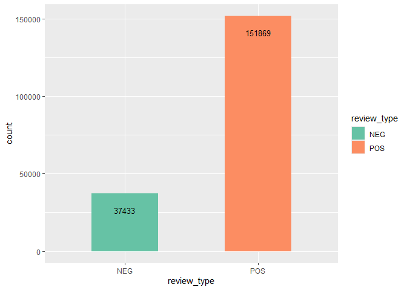
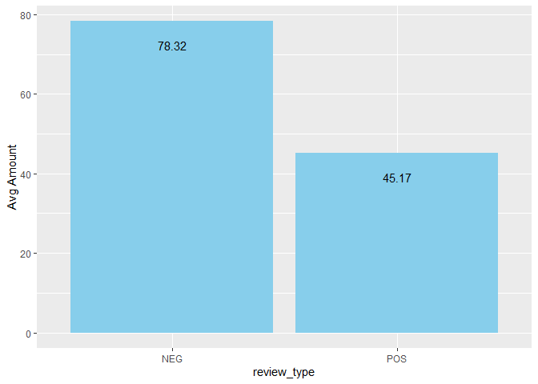
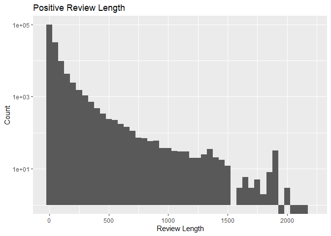
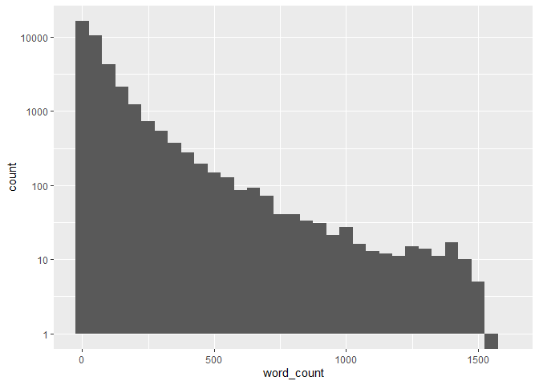
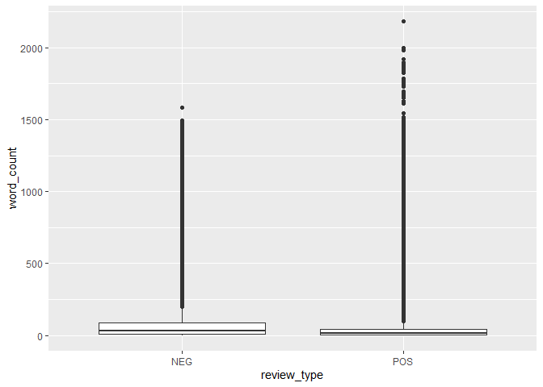
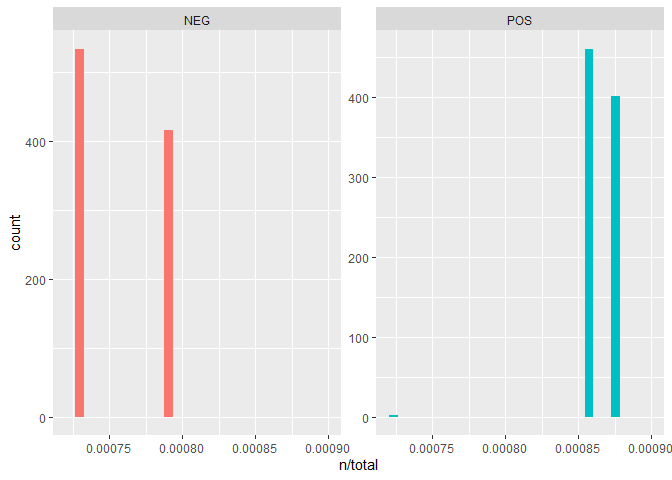

# 2-data-analysis


**Note**: Please run
[0-data-exploration](https://github.com/Data-Sci-2025/Steam-Reviews-Analysis/blob/main/data_processing/0-data-exploration.qmd)
and
[1-data-cleanup](https://github.com/Data-Sci-2025/Steam-Reviews-Analysis/blob/main/data_processing/1-data-cleanup.qmd)
first to create the version of the .csv file needed to start here.

``` r
# reviews 
reviews_df <- read_csv("../private/reviews_analyze.csv", show_col_types = FALSE)

# game titles, ranks, etc, we'll need it later
games <- read_csv("../notes_and_info/0-gameinfo.csv", show_col_types = FALSE)
```

``` r
reviews_df <- reviews_df |>
  #rename from the tokenized col from before
  rename(tokens = merged_text)

reviews_df
```

    # A tibble: 189,873 × 7
       review_id language date       review_type review              steam_id tokens
           <dbl> <chr>    <date>     <chr>       <chr>                  <dbl> <chr> 
     1 205434212 english  2025-08-29 POS         The atmosphere and…   239200 the, …
     2 205407336 english  2025-08-28 NEG         Gameplay is lackin…   239200 gamep…
     3 205265837 english  2025-08-27 NEG         So, if you are hop…   239200 so, i…
     4 205236599 english  2025-08-26 POS         Eerie suspenseful …   239200 eerie…
     5 205099824 english  2025-08-24 NEG         just play the 1st …   239200 just,…
     6 205035565 english  2025-08-23 NEG         This game has good…   239200 this,…
     7 205004797 english  2025-08-23 POS         Absolute Cinema       239200 absol…
     8 204962454 english  2025-08-22 POS         Mostly a walking s…   239200 mostl…
     9 204909988 english  2025-08-22 NEG         I enjoyed the game…   239200 i, en…
    10 204877346 english  2025-08-21 NEG         Wish I could love …   239200 wish,…
    # ℹ 189,863 more rows

## Downsampling Data

Move the measurement stuff up here that first showed the hugely
disparate numbers of both reviews per games and positive vs negative
reviews.

Use the table in the questions menu below but merge it with the games
info too to include the game’s rank to prove the point.

Positively reviewed games have more reviews than negatively reviewed
games quite significantly. To account for this I decided to downsample
those positively reviewed games

## TO DO

downsample positive reviews to 37k

set seed in R - set.seed(1234) on the downsampling code so other people
get the same sampling

slice_sample - stratified downsampling

1.  Should I cap number of reviews per game to even things out? YES -
    DOWNSAMPLING

``` r
reviews_df |>
  group_by(steam_id) |>
  summarise(count = n()) |>
  arrange(desc(count))
```

    # A tibble: 45 × 2
       steam_id count
          <dbl> <int>
     1   753640 18646
     2  1049410 16134
     3   481510 14510
     4  1145360 14409
     5   632470 12511
     6    47780 12361
     7   413150 11413
     8  1703340 10558
     9   221040 10555
    10  1119730  9721
    # ℹ 35 more rows

Some of these have way more reviews than others (positive games) and it
could be affecting some of what I’m looking at objectively… on the other
hand it’s the most accurate look at the data.

2.  I made some histograms for word count per review type (pos or neg)
    and they’re both really skewed with a huge chunk of the reviews
    being very short (see the Length Stats tab here). It’s making it so
    I can’t really do a box plot or a violin plot because of the shape
    of things. Would a log transformation help? YES

3.  similar toks charts not working why?????

## Some Missed Cleanup

While I was working on word counts I discovered a number of unicode
blank spaces that were appearing as empty cells in the “review” column
and were being counted as 1 word reviews. They were also messing with
some of my later work with tokenization and tf-idf.

I had to go through, find the blank rows among the 1 word reviews, use
charToRaw on the review ID associated, and search online to find the
unicode string to search for and remove.

I went over the top to remove from both reviews and token columns, just
to be sure I was getting everything and removing the full row. It seemed
like when I didn’t, the rows weren’t being entirely eliminated when they
needed to be. Overkill is fine with me if the end result is what I’m
after!

## Getting a Look at the Data

Number of reviews per game:

``` r
reviews_df |>
  group_by(steam_id) |>
  summarise(count = n()) |>
  arrange(desc(count))
```

    # A tibble: 45 × 2
       steam_id count
          <dbl> <int>
     1   753640 18607
     2  1049410 16078
     3   481510 14486
     4  1145360 14311
     5   632470 12465
     6    47780 12318
     7   413150 11358
     8  1703340 10527
     9   221040 10525
    10  1119730  9671
    # ℹ 35 more rows

Do this with the merged games df so that the labels will be the actual
game names

How many reviews of each type are there?

``` r
ggplot(reviews_df, aes(x=review_type, fill=review_type )) + 
  geom_bar( width = 0.5) +
  scale_fill_brewer(palette = "Set2") +
  geom_text(stat = "count", aes(label = after_stat(count)), size = 3.5, vjust = 3, hjust = 0.5, position = "stack") +
  theme(legend.position="right")
```



There are a LOT more positive reviews than negative ones. This made me
curious, what about the total data. It’s possible positively reviewed
games have more reviews in general than negatively reviewed games?

Since the number of reviews (total and in English) at [this
table](https://github.com/Data-Sci-2025/Steam-Reviews-Analysis/blob/main/notes_and_info/0-gameinfo.csv)
were added manually by me using the total listing on the Steam App.
Those numbers are accurate as of the date I downloaded my reviews (shown
in my
[projnotes.md](https://github.com/Data-Sci-2025/Steam-Reviews-Analysis/blob/main/notes_and_info/projnotes.md)).
However the script I used to download the reviews would time out after a
certain point, and not every single review was downloaded.

Let’s look at the actual count of reviews per game ranking, simplified
down to only positive, negative, and mixed for ease.

``` r
merged_games <- reviews_df |>
  left_join(games)
```

    Joining with `by = join_by(steam_id)`

``` r
merged_games |>
  group_by(rank) |>
  #merging all varieties of pos/neg together by removing the first word per rank
  #very positive and overwhelmingly positive both just become positive etc
  mutate(rank = str_replace_all(rank, "\\w+ (\\w)", "\\1")) |>
  summarise(count = n())
```

    # A tibble: 3 × 2
      rank      count
      <chr>     <int>
    1 Mixed     15651
    2 Negative  22368
    3 Positive 151279

It looks like kind of yes!

My theory here just comes down to popularity. As a game releases and
players try it out and review it, it either begins to migrate through
the ranks of positive or negative. As new players find out about the
game, if it shows already that it’s being negatively reviewed, why would
they spend money to try it out themselves? I wouldn’t! On the other
hand, if players see that a game is getting positive reviews, they’ll
more likely try it and, in turn, also positively review it.

Some of the games in the higher ranks in this data are hugely beloved
games, while the negative ones are very likely largely forgotten to time
once they descended into the negative review rankings.

So, there it is. Positively ranked games have overall more reviews than
negatively ranked games, and there are more positive reviews than
negative ones in my data as a result. We’ll keep that in mind, moving
forward.

## Word Count

``` r
reviews_df <- reviews_df |>
  mutate(word_count = str_count(tokens, '\\,')+1)

reviews_df
```

    # A tibble: 189,298 × 8
       review_id language date       review_type review   steam_id tokens word_count
           <dbl> <chr>    <date>     <chr>       <chr>       <dbl> <chr>       <dbl>
     1 205434212 english  2025-08-29 POS         The atm…   239200 the, …         74
     2 205407336 english  2025-08-28 NEG         Gamepla…   239200 gamep…          9
     3 205265837 english  2025-08-27 NEG         So, if …   239200 so, i…        104
     4 205236599 english  2025-08-26 POS         Eerie s…   239200 eerie…        136
     5 205099824 english  2025-08-24 NEG         just pl…   239200 just,…          5
     6 205035565 english  2025-08-23 NEG         This ga…   239200 this,…        110
     7 205004797 english  2025-08-23 POS         Absolut…   239200 absol…          2
     8 204962454 english  2025-08-22 POS         Mostly …   239200 mostl…        220
     9 204909988 english  2025-08-22 NEG         I enjoy…   239200 i, en…         33
    10 204877346 english  2025-08-21 NEG         Wish I …   239200 wish,…         28
    # ℹ 189,288 more rows

### Review length

With word counts per review added, let’s take a look!

``` r
summary(reviews_df$word_count)
```

       Min. 1st Qu.  Median    Mean 3rd Qu.    Max. 
       1.00    5.00   17.00   51.59   50.00 2182.00 

So the average review is around 51 words long, and the median 17 words.

Let’s look a little deeper.

``` r
reviews_df |>
  filter(word_count==1)
```

    # A tibble: 13,409 × 8
       review_id language date       review_type review  steam_id tokens  word_count
           <dbl> <chr>    <date>     <chr>       <chr>      <dbl> <chr>        <dbl>
     1 201605730 english  2025-07-07 POS         Peak      239200 peak             1
     2 200743403 english  2025-06-26 NEG         bad       239200 bad              1
     3 197815403 english  2025-05-21 POS         meh       239200 meh              1
     4 195500370 english  2025-04-24 POS         Best      239200 best             1
     5 194075241 english  2025-04-02 POS         Classic   239200 classic          1
     6 191186015 english  2025-02-26 POS         pig       239200 pig              1
     7 190284038 english  2025-02-15 POS         oink      239200 oink             1
     8 190005117 english  2025-02-12 NEG         idk       239200 idk              1
     9 186869243 english  2025-01-01 NEG         no        239200 no               1
    10 185722507 english  NA         POS         pig       239200 pig              1
    # ℹ 13,399 more rows

``` r
reviews_df |>
  filter(word_count>1700)
```

    # A tibble: 51 × 8
       review_id language date       review_type review   steam_id tokens word_count
           <dbl> <chr>    <date>     <chr>       <chr>       <dbl> <chr>       <dbl>
     1 169799070 english  2024-06-14 POS         im goin…   632470 im, g…       1980
     2 202889082 english  2025-07-26 POS         I think…  1703340 i, th…       1876
     3 198792433 english  2025-06-03 POS         the end…  1703340 the, …       1730
     4 196181590 english  2025-05-01 POS         the end…  1703340 the, …       1883
     5 195331550 english  2025-04-21 POS         The end…  1703340 the, …       1883
     6 194031541 english  2025-04-02 POS         The end…  1703340 the, …       1883
     7 192702260 english  2025-03-14 POS         THE END…  1703340 the, …       1883
     8 192121032 english  2025-03-06 POS         The end…  1703340 the, …       1882
     9 191174046 english  2025-02-25 POS         The End…  1703340 the, …       1880
    10 191032150 english  2025-02-24 POS         The end…  1703340 the, …       2182
    # ℹ 41 more rows

There’s quite a few one-word reviews! Some of them are pretty
reasonable… “Amazing”, “Spooky”, “Boring”, “Unplayable”. Short and
sweet, gets the point across well enough. Others are a little less
obvious. I saw a number of keyboard smash reviews, strings of numbers, I
saw one that was just a rabbit emoji. The last one might be a reference
I just don’t understand.

Looking next at these longest reviews, I was really surprised! A huge
majority of these are exactly the same phrase repeated over and over,
and those repeated reviews are all for the same game, as well. I have to
do some investigation…

Checking my game info
[here](https://github.com/Data-Sci-2025/Steam-Reviews-Analysis/blob/main/notes_and_info/0-gameinfo.csv),
I was able to confirm that these repeating reviews are all from “The
Stanley Parable: Ultra Deluxe”.

Looking further, I found some more information. [“The end is
never”](https://thestanleyparable.fandom.com/wiki/The_End_Is_Never...)
is a tagline for the game itself, and appears within the game multiple
times as a reference to the inescapable time loop the game’s protagonist
is stuck in. The phrase also apparently appears on the game’s loading
screens in a constant loop.

### Average Review Length

Now to what we came here to look into. Are positive reviews typically
longer, or negative reviews?

``` r
ggplot(reviews_df, aes(x=review_type, y = word_count)) + 
  stat_summary(fun = mean, geom = "bar", fill = "skyblue") +
  geom_text(aes(label = after_stat(sprintf("%.2f", y))), stat = "summary", fun = "mean", vjust = 3, hjust=0.5) +
  ylab("Avg Amount") +
  theme(legend.position="right")
```



Now that’s really interesting! Despite having fewer reviews total, and
*all* of the longest reviews we looked at above being positive, negative
reviews are still quite a bit longer on average. People must have a lot
more to say when they dislike a game than when they like one!

I wonder if there’s a trend in shorter reviews that might be swinging
this average one way or the other.

``` r
reviews_df |>
  group_by(review_type) |>
  filter(word_count<6) |>
  summarise(word_count = sum(word_count))
```

    # A tibble: 2 × 2
      review_type word_count
      <chr>            <dbl>
    1 NEG              14475
    2 POS             112923

Looks like it’s pretty common for positive reviews to be shorter. This
could potentially drag down the overall average of positive reviews.
However… there are more short positive reviews, but there are also more
positive reviews in general, so maybe not.

38.7% of all negative reviews are 5 words or shorter, and 74.4% of all
positive reviews are. That’s quite a big chunk of reviews!

NOW look at average review length per game, add that together to look at
per game rank too.

### Length Stats

Word length histograms…. A LOT of reviews are all grouped together at
the lower end of the spectrum DO A LOG TRANSFORMATION TO THEM AND REDO

``` r
posrevs <- reviews_df |>
  filter(review_type=='POS')

negrevs <- reviews_df |>
  filter(review_type=='NEG')
```

``` r
pos <- ggplot(posrevs, aes(x=word_count)) + 
  geom_histogram(binwidth = 50) +
  scale_y_log10()
pos
```

    Warning in scale_y_log10(): log-10 transformation introduced infinite values.



``` r
neg <- ggplot(negrevs, aes(x=word_count)) + 
  geom_histogram(binwidth = 50) +
  scale_y_log10()
neg
```

    Warning in scale_y_log10(): log-10 transformation introduced infinite values.



Can I log transform this and then make box or violin plots?

``` r
ggplot(reviews_df, aes(x=review_type, y=word_count)) + 
  geom_boxplot() 
```



``` r
  #geom_jitter(shape=16, position=position_jitter(0.2))
```

``` r
ggplot(reviews_df, aes(x=word_count, y=review_type)) + 
  geom_violin()
```


## Word Types & Count

``` r
remove_dupes <- function(x) {
  #split tokens to be iterated over
  words <- strsplit(x, " ")[[1]]
  #apply the unique() function per row
  unique_words <- unique(words)
  #re-collapse into rows
  paste(unique_words, collapse = " ")
}
```

``` r
# get word types by removing duplicates from tokens rows
reviews_df$types <- sapply(reviews_df$tokens, remove_dupes)
```

``` r
reviews_df <- reviews_df |>
  mutate(type_count = str_count(types, '\\,')+1)
```

## TTR

TTR is used to measure the variety of language used in a text. It’s not
exactly a measure of the complexity of a document, but can be considered
with other factors as an indicator of a writer’s language abilities.

TTR is measured by dividing the total number of word types (unique words
used) by total number of word tokens (all words used). A low score
(closer to 0) indicates a highly repetitive document, and a high score
(closer to 1) indicates a higher variety or words. A score of 1 would
mean that no words were repeated in the document.

TTR is very sensitive to document length. Too long, and documents taper
off. There are only so many content words to be used in a document,
eventually the highly repetitive function words will outnumber them.

[source](https://medium.com/@rajeswaridepala/empirical-laws-ttr-cc9f826d304d)

``` r
reviews_df <- reviews_df |>
  mutate(TTR = type_count/word_count)

reviews_df
```

    # A tibble: 189,298 × 11
       review_id language date       review_type review   steam_id tokens word_count
           <dbl> <chr>    <date>     <chr>       <chr>       <dbl> <chr>       <dbl>
     1 205434212 english  2025-08-29 POS         The atm…   239200 the, …         74
     2 205407336 english  2025-08-28 NEG         Gamepla…   239200 gamep…          9
     3 205265837 english  2025-08-27 NEG         So, if …   239200 so, i…        104
     4 205236599 english  2025-08-26 POS         Eerie s…   239200 eerie…        136
     5 205099824 english  2025-08-24 NEG         just pl…   239200 just,…          5
     6 205035565 english  2025-08-23 NEG         This ga…   239200 this,…        110
     7 205004797 english  2025-08-23 POS         Absolut…   239200 absol…          2
     8 204962454 english  2025-08-22 POS         Mostly …   239200 mostl…        220
     9 204909988 english  2025-08-22 NEG         I enjoy…   239200 i, en…         33
    10 204877346 english  2025-08-21 NEG         Wish I …   239200 wish,…         28
    # ℹ 189,288 more rows
    # ℹ 3 more variables: types <chr>, type_count <dbl>, TTR <dbl>

### TTR Exploring

idk think about what to put in here - probably just a general summary
looking at pos/neg, it will likely mostly be aligned with review length
over all, since so many reviews are so short.

## Tf-idf

Calculating Tf-idf for our game reviews. Because they were creating a
lot of issues with tokenizing and odd characters, I’ve excluded emojis
and gone simply for text reviews. It’s a bummer to lose out on such
strong reviews as “one single poop emoji”, but needs to be done for ease
of processing. For now, at least.

``` r
data(stop_words)

tokens_df <- reviews_df |>
  unnest_tokens(word, review) |>
  anti_join(stop_words)
```

    Joining with `by = join_by(word)`

``` r
tokens_df <- tokens_df |>
  count(word, sort = TRUE) 

tokens_df
```

    # A tibble: 103,185 × 2
       word            n
       <chr>       <int>
     1 game       233068
     2 story       36864
     3 play        36631
     4 time        29551
     5 games       29386
     6 10          28188
     7 fun         25786
     8 played      19395
     9 love        17401
    10 experience  15300
    # ℹ 103,175 more rows

By tokenizing and removing stop words, which in this case also removed
all emojis and special characters, we went from around 11 million tokens
(from [data cleanup
tokenizing](https://github.com/Data-Sci-2025/Steam-Reviews-Analysis/blob/main/data_processing/1-data-cleanup.md#tokenizing))
down to 3.6 million (from calculating sum(n) on tokens_df).

The most common word token among these game reviews…. is game!

Looking through the first few pages of tokens, I wonder if we can pick
out some key words of game elements reviewers find important enough to
comment on specifically. I see story, gameplay, characters, hours (game
length, probably), worth (game price, I bet), puzzles, pretty, money,
music, graphics… all in the top 50 words.

What about top words per review type?

REDO THIS merge into reviews_df as a new df and do the pos/neg thing by
filtering instead.

``` r
pos_toks <- posrevs |>
  unnest_tokens(word, review) |>
  anti_join(stop_words) |>
  count(word, sort = TRUE)
```

    Joining with `by = join_by(word)`

``` r
pos_toks
```

    # A tibble: 83,753 × 2
       word            n
       <chr>       <int>
     1 game       166027
     2 story       29997
     3 play        27901
     4 10          24908
     5 games       22593
     6 fun         21449
     7 time        20943
     8 love        15525
     9 played      15437
    10 experience  13096
    # ℹ 83,743 more rows

``` r
neg_toks <- negrevs |>
  unnest_tokens(word, review) |>
  anti_join(stop_words) |>
  count(word, sort = TRUE)
```

    Joining with `by = join_by(word)`

``` r
neg_toks
```

    # A tibble: 50,260 × 2
       word      n
       <chr> <int>
     1 game  67041
     2 play   8730
     3 time   8608
     4 story  6867
     5 games  6793
     6 bad    6186
     7 buy    5522
     8 money  4455
     9 fun    4337
    10 2      4096
    # ℹ 50,250 more rows

### TF

calculate the frequency for each word for the works of Jane Austen, the
Brontë sisters, and H.G. Wells by binding the data frames together -
RECALCULATE THIS TOO - per review, per review type, recheck activity 9
to make sure that seems right

``` r
frequency <- tokens_df |>
  mutate(proportion = n / sum(n)) |>
  select(-n)

frequency
```

    # A tibble: 103,185 × 2
       word       proportion
       <chr>           <dbl>
     1 game          0.0645 
     2 story         0.0102 
     3 play          0.0101 
     4 time          0.00818
     5 games         0.00813
     6 10            0.00780
     7 fun           0.00714
     8 played        0.00537
     9 love          0.00482
    10 experience    0.00423
    # ℹ 103,175 more rows

This means that 64% of all the words in game reviews is the word game???

### Plotting

``` r
freq <- bind_rows(mutate(pos_toks, review_type = "Positive"),
                       mutate(neg_toks, review_type = "Negative")) |> 
  mutate(word = str_extract(word, "[a-z']+")) |>
  count(review_type, word) |>
  group_by(review_type) |>
  mutate(proportion = n / sum(n)) |> 
  select(-n) |> 
  pivot_wider(names_from = review_type, values_from = proportion) |>
  pivot_longer(Positive:Negative,
               names_to = "review_type", values_to = "proportion")

freq
```

    # A tibble: 162,646 × 3
       word  review_type proportion
       <chr> <chr>            <dbl>
     1 '     Positive     0.000179 
     2 '     Negative     0.0000199
     3 a     Positive     0.000609 
     4 a     Negative     0.000776 
     5 aa    Positive     0.0000119
     6 aa    Negative     0.0000398
     7 aaa   Positive     0.0000239
     8 aaa   Negative     0.0000199
     9 aaaa  Positive     0.0000119
    10 aaaa  Negative     0.0000199
    # ℹ 162,636 more rows

### In progress: similar tokens pos & neg

``` r
ggplot(freq, aes(x = proportion, y = review_type, 
                      color = abs(proportion))) +
  geom_abline(color = "gray40", lty = 2) +
  geom_jitter(alpha = 0.1, size = 2.5, width = 0.3, height = 0.3) +
  geom_text(aes(label = word), check_overlap = TRUE, vjust = 1.5) +
  scale_x_log10(labels = percent_format()) +
  scale_y_log10(labels = percent_format()) +
  scale_color_gradient(limits = c(0, 0.001), 
                       low = "darkslategray4", high = "gray75") +
  facet_wrap(~review_type, ncol = 2) +
  theme(legend.position="none") 
```

- labs(y = “Jane Austen”, x = NULL)

Words closest to the line have similar frequencies in both samples

Also: not all the words are found in all three sets of texts and there
are fewer data points in the panel for Austen and H.G. Wells.

quantify how similar and different these sets of word frequencies are
using a correlation test

### term freq

``` r
review_words <- reviews_df |>
  unnest_tokens(word, review) |>
  anti_join(stop_words) |>
  count(review_id, word, sort = TRUE)
```

    Joining with `by = join_by(word)`

``` r
total_words <- review_words |> 
  group_by(review_id) |> 
  summarize(total = sum(n))

review_words <- left_join(review_words, total_words)
```

    Joining with `by = join_by(review_id)`

``` r
review_words <- left_join(reviews_df, review_words)
```

    Joining with `by = join_by(review_id)`

``` r
review_words <- review_words |>
  select(review_id, review_type, word, n, total)

review_words
```

    # A tibble: 3,045,610 × 5
       review_id review_type word           n total
           <dbl> <chr>       <chr>      <int> <int>
     1 205434212 POS         dark           2    38
     2 205434212 POS         descent        2    38
     3 205434212 POS         atmosphere     1    38
     4 205434212 POS         core           1    38
     5 205434212 POS         design         1    38
     6 205434212 POS         driven         1    38
     7 205434212 POS         enemies        1    38
     8 205434212 POS         engaging       1    38
     9 205434212 POS         faaar          1    38
    10 205434212 POS         fan            1    38
    # ℹ 3,045,600 more rows

Calculating the total word counts per word and by review type and
comparing to the total word counts by review type. With these, we can
get moving on tf-idf.

``` r
ggplot(review_words, aes(n/total, fill = review_type)) +
  geom_histogram(show.legend = FALSE) +
  xlim(NA, 0.0009) +
  facet_wrap(~review_type, ncol = 2, scales = "free_y")
```

    `stat_bin()` using `bins = 30`. Pick better value `binwidth`.

    Warning: Removed 3043798 rows containing non-finite outside the scale range
    (`stat_bin()`).

    Warning: Removed 2 rows containing missing values or values outside the scale range
    (`geom_bar()`).



### bind_tf_idf() function

find the important words for the content of each document by decreasing
the weight for commonly used words and increasing the weight for words
that are not used very much in a collection or corpus of documents

- which words are the words that define the text?

- what words are common (but not too common)?

bind_tf_idf()

takes a tidy text dataset as input with one row per token (term), per
document

- one column contains the terms/tokens (word)
- one column contains the documents (review type)
- last necessary column contains the counts, how many times each
  document contains each term (n)

maybe edit to carry in also steam_id I think, just so it’s in there.
MAYBE do this from the merged games df - but you have to re-merge it
because the original is actually merged before the word counts etc have
been added in. THEN save the game names and also the rank - simplify
that rank in a new column to “pos, mixed, neg” and try that with the
classifier. If we can calculate % of pos/neg ratio of reviews per game
can we predict the game’s rank?

``` r
review_tf_idf <- review_words |>
  bind_tf_idf(word, review_id, n)

review_tf_idf
```

    # A tibble: 3,045,610 × 8
       review_id review_type word           n total     tf   idf tf_idf
           <dbl> <chr>       <chr>      <int> <int>  <dbl> <dbl>  <dbl>
     1 205434212 POS         dark           2    38 0.0526  3.82  0.201
     2 205434212 POS         descent        2    38 0.0526  4.67  0.246
     3 205434212 POS         atmosphere     1    38 0.0263  3.87  0.102
     4 205434212 POS         core           1    38 0.0263  5.10  0.134
     5 205434212 POS         design         1    38 0.0263  3.92  0.103
     6 205434212 POS         driven         1    38 0.0263  5.24  0.138
     7 205434212 POS         enemies        1    38 0.0263  4.40  0.116
     8 205434212 POS         engaging       1    38 0.0263  4.67  0.123
     9 205434212 POS         faaar          1    38 0.0263 11.5   0.302
    10 205434212 POS         fan            1    38 0.0263  4.13  0.109
    # ℹ 3,045,600 more rows

with stop words included there are 6,412,302 total rows with stop words
excluded it went down to 3,045,610!

``` r
review_tf_idf |>
  arrange(desc(n))
```

    # A tibble: 3,045,610 × 8
       review_id review_type word        n total    tf   idf tf_idf
           <dbl> <chr>       <chr>   <int> <int> <dbl> <dbl>  <dbl>
     1 161023893 POS         jim      2000  2000 1      7.15   7.15
     2  83402934 POS         10       1380  1382 0.999  2.45   2.45
     3 115935793 POS         wake     1000  1000 1      6.00   6.00
     4 168806956 POS         play      650   650 1      1.92   1.92
     5 128455542 POS         stanley   604   604 1      4.38   4.38
     6 100072229 POS         buy       562   564 0.996  3.02   3.01
     7 154303785 POS         re6       456   456 1      6.01   6.01
     8 190323420 POS         bucket    434   434 1      4.87   4.87
     9 186143816 POS         bucket    420   420 1      4.87   4.87
    10 141126673 POS         wake      399   399 1      6.00   6.00
    # ℹ 3,045,600 more rows

``` r
review_tf_idf <- review_tf_idf |>
  select(review_id, review_type, word, total, tf_idf)

review_tf_idf
```

    # A tibble: 3,045,610 × 5
       review_id review_type word       total tf_idf
           <dbl> <chr>       <chr>      <int>  <dbl>
     1 205434212 POS         dark          38  0.201
     2 205434212 POS         descent       38  0.246
     3 205434212 POS         atmosphere    38  0.102
     4 205434212 POS         core          38  0.134
     5 205434212 POS         design        38  0.103
     6 205434212 POS         driven        38  0.138
     7 205434212 POS         enemies       38  0.116
     8 205434212 POS         engaging      38  0.123
     9 205434212 POS         faaar         38  0.302
    10 205434212 POS         fan           38  0.109
    # ℹ 3,045,600 more rows

``` r
write_csv(review_tf_idf, file="../private/reviews_tfidf.csv")
```

``` r
reviews_df |>
  filter(review_id==161023893)
```

    # A tibble: 1 × 11
      review_id language date       review_type review    steam_id tokens word_count
          <dbl> <chr>    <date>     <chr>       <chr>        <dbl> <chr>       <dbl>
    1 161023893 english  2024-02-21 POS         JIM JIM …  1703340 jim, …       2000
    # ℹ 3 more variables: types <chr>, type_count <dbl>, TTR <dbl>

how to quantify what a document is about

tf - term frequency - how frequently a word shows up idf - inverse
document frequency- how many documents a word appears in (no of docs /
no of dccs containing term)

tf-idf: frequency of a term adjusted for how rarely it is used

- intended to measure how important a word is to a document in a
  collection (or corpus) of documents

Some notes to pay attention to:

idf and thus tf-idf are zero for these extremely common words - words
that appear in all six of austen’s novels - this decreases the weight
for these extremely common words

idf will be a higher number for words that occur in fewer of the
documents in the collection

To take a look at high idf terms:

``` r
review_tf_idf %>%
  select(-total) %>%
  arrange(desc(tf_idf))
```

    # A tibble: 3,045,610 × 4
       review_id review_type word                                             tf_idf
           <dbl> <chr>       <chr>                                             <dbl>
     1 190511090 POS         ᐢ                                                  12.2
     2 149568927 POS         yeaaaaaaaaaaaaa                                    12.2
     3 136100652 POS         goeg                                               12.2
     4 136084968 POS         jäyheliha                                          12.2
     5 125890956 NEG         eugh                                               12.2
     6 116029011 POS         pigophobia                                         12.2
     7  98903683 POS         6ez9                                               12.2
     8  97827725 NEG         wuehdgaydgydwgsdhgahjgdwywgudsjshadsuqywquwhkjd…   12.2
     9  95280179 POS         lliiiiiiiiiiiiiit                                  12.2
    10  78081112 NEG         zzzzzzzzzzzzzzzzzzzzzz                             12.2
    # ℹ 3,045,600 more rows

SUMMARY - these are informative in the sense that they are not likley to
be replicated, I suppose. Not so much in like. discerning meaning.

``` r
book_tf_idf %>%
  group_by(book) %>%
  slice_max(tf_idf, n = 15) %>%
  ungroup() %>%
  ggplot(aes(tf_idf, fct_reorder(word, tf_idf), fill = book)) +
  geom_col(show.legend = FALSE) +
  facet_wrap(~book, ncol = 2, scales = "free") +
  labs(x = "tf-idf", y = NULL)
```

We can conclude: jane austen uses a lot of the same language between her
books, and the thing that really distinguishes them is the characters in
them and locations.
