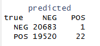

# 3-classifier


**Note**: Please run
[0-data-exploration](https://github.com/Data-Sci-2025/Steam-Reviews-Analysis/blob/main/data_processing/0-data-exploration.qmd),
[1-data-cleanup](https://github.com/Data-Sci-2025/Steam-Reviews-Analysis/blob/main/data_processing/1-data-cleanup.qmd),
and
[2-data-analysis](https://github.com/Data-Sci-2025/Steam-Reviews-Analysis/blob/main/data_processing/2-data-analysis.qmd)
first to create the version of the .csv file needed to start here.

## Classifier Data

To get another look at the df to be used to train the classifier later.
This is the tf-idf information for the downsampled version of the game
reviews data, stop words removed.

``` r
review_tf_idf <- read_csv("../private/reviews_tfidf.csv", show_col_types = FALSE)

review_tf_idf
```

    # A tibble: 1,430,815 × 5
       review_id review_type word        total tf_idf
           <dbl> <chr>       <chr>       <dbl>  <dbl>
     1 105382110 POS         hide           31 0.398 
     2 105382110 POS         story          31 0.133 
     3 105382110 POS         4              31 0.112 
     4 105382110 POS         aesthetic      31 0.193 
     5 105382110 POS         basically      31 0.136 
     6 105382110 POS         beat           31 0.147 
     7 105382110 POS         button         31 0.154 
     8 105382110 POS         cool           31 0.119 
     9 105382110 POS         essentially    31 0.174 
    10 105382110 POS         game           31 0.0171
    # ℹ 1,430,805 more rows

### Remove NA

Just to double check and clean out any troublesome NA values:

``` r
colSums(is.na(review_tf_idf))
```

      review_id review_type        word       total      tf_idf 
              0           0        2007        2007        2007 

``` r
review_tf_idf <- na.omit(review_tf_idf)
```

``` r
colSums(is.na(review_tf_idf))
```

      review_id review_type        word       total      tf_idf 
              0           0           0           0           0 

``` r
review_tf_idf |>
  group_by(review_type) |>
  summarise(count=n())
```

    # A tibble: 2 × 2
      review_type  count
      <chr>        <int>
    1 NEG         901027
    2 POS         527781

## One more cleanup

As was covered toward the end of my analysis notebook, there are many
many words that are the same between both review types (the classes our
classifier is going to attempt to predict). Because these words appear
so commonly in both classes, it gave the classifier a tough time trying
to predict a review’s class. My first attempt guessed every single
review negative.

After talking with Dan we decided the best move would be to make a
custom list of stop words using these highly common and overlapping
words (that will have a really low tf-idf value anyway) to break it down
into the more distinctive words and maybe get a cleaner prediction.

``` r
posfreq <- review_tf_idf |>
  filter(review_type=='POS') |>
  arrange(tf_idf)
posfreq
```

    # A tibble: 527,781 × 5
       review_id review_type word  total  tf_idf
           <dbl> <chr>       <chr> <dbl>   <dbl>
     1 125061622 POS         game    379 0.00140
     2 169090094 POS         game    293 0.00181
     3  78688909 POS         game    230 0.00230
     4 131377160 POS         10     1001 0.00254
     5 196639263 POS         game    206 0.00257
     6 131377160 POS         2      1001 0.00284
     7 154068333 POS         game    184 0.00288
     8 180039771 POS         game    180 0.00294
     9  15055915 POS         time    687 0.00297
    10  15055915 POS         story   687 0.00300
    # ℹ 527,771 more rows

``` r
negfreq <- review_tf_idf |>
  filter(review_type=='NEG') |>
  arrange(tf_idf)
negfreq
```

    # A tibble: 901,027 × 5
       review_id review_type word  total   tf_idf
           <dbl> <chr>       <chr> <dbl>    <dbl>
     1 144400423 NEG         game    628 0.000843
     2 168667100 NEG         game    589 0.000899
     3  12318072 NEG         game    527 0.00100 
     4 193052341 NEG         game    301 0.00176 
     5 171917568 NEG         game    293 0.00181 
     6  84272391 NEG         game    573 0.00185 
     7  29419899 NEG         10     1366 0.00186 
     8 107657442 NEG         game    268 0.00198 
     9  29419899 NEG         2      1366 0.00208 
    10 163132462 NEG         game    251 0.00211 
    # ℹ 901,017 more rows

``` r
summary(review_tf_idf$tf_idf)
```

         Min.   1st Qu.    Median      Mean   3rd Qu.      Max. 
    8.429e-04 4.537e-02 9.950e-02 2.449e-01 2.297e-01 1.122e+01 

``` r
reviews_shortened <- review_tf_idf |>
  filter(tf_idf > .009)

reviews_shortened |>
  group_by(review_type) |>
  summarise(count=n())
```

    # A tibble: 2 × 2
      review_type  count
      <chr>        <int>
    1 NEG         894348
    2 POS         524953

``` r
mystopwords <- tibble(word = c("game", "10", "2", "3", "play", "1", "4", "5", "time", "fun", "story", "games", "buy", "20", "gameplay", "6", "worth", "times", "100", "playing", "played", "30", "world", "9", "recommend", "8", "7"))
```

By looking through the first several rows of the dataframe above as well
as the top tokens shared that I spotted in my analysis notebook, I’ve
added a list of highly frequent and shared words that wouldn’t indicate
either POS or NEG review strongly in either direction.

``` r
reviews_shortened <- anti_join(review_tf_idf, mystopwords, by="word")
```

``` r
reviews_shortened |>
  group_by(review_type) |>
  summarise(count=n())
```

    # A tibble: 2 × 2
      review_type  count
      <chr>        <int>
    1 NEG         810758
    2 POS         457868

## Data Setup

Even after downsampling and removing stop words, I ran into issues
trying to pivot my very large dataframe wider.

Initially I sampled lines 1:400,000 of my data which worked well enough!
But when I started to train the classifier on it, ran into an issue
where even in all those rows, only POS marked reviews were appearing.

Instead, I did a random sampling method of 300,000 rows of data and
confirmed afterward that it contained both NEG and POS marked reviews.

setup_sample \<- sample_n(reviews_shortened, 800)

**Note that for rendered .md sampled slice is much smaller than in the
.qmd file because rendering kept timing out**

``` r
set.seed(14)
setup_sample <- reviews_shortened |>
  group_by(review_type) |>
  slice_sample(n = 10000)

setup_sample <-setup_sample |>
  rename(WC=total)
  
setup_sample
```

    # A tibble: 20,000 × 5
    # Groups:   review_type [2]
       review_id review_type word           WC tf_idf
           <dbl> <chr>       <chr>       <dbl>  <dbl>
     1 137657294 NEG         telling        61 0.0842
     2  12144347 NEG         care           97 0.0449
     3  12178556 NEG         purchased      53 0.201 
     4 135777304 NEG         special        34 0.143 
     5   7854266 NEG         elements       63 0.0723
     6  49021712 NEG         sold           29 0.191 
     7   2152783 NEG         pc             42 0.0910
     8  16341665 NEG         environment    19 0.268 
     9 202376910 NEG         exact         123 0.0477
    10  11398426 NEG         horror         79 0.0431
    # ℹ 19,990 more rows

``` r
setup_sample |>
  group_by(review_type) |>
  summarise(count=n())
```

    # A tibble: 2 × 2
      review_type count
      <chr>       <int>
    1 NEG         10000
    2 POS         10000

Columns (words) with digits as the column name were creating an issue

``` r
setup_sample <- setup_sample |>
  mutate(word = str_replace_all(word, "(^\\d.*$)", "i_\\1"))
```

Pivot wider so that all the individual words appear as column names,
populated below by tf-idf values per review.

``` r
setup_sample <- setup_sample |>
  pivot_wider(names_from = word, values_from = tf_idf, values_fill = 0)

ncol(setup_sample)
```

    [1] 6895

Because of how the classifier works, any word that only appears once in
any of the reviews (has only one tf-idf value over 0) would be
discarded. If we train a classifier on the word “refund” and that word
only appears once in this data subset, it would never encounter the word
“refund” in the testing data to apply that classification weight to.
It’s wasted computing space and power on a word that it will never see
again.

To get rid of them in advance and ease the classification training
process, this chunk will discard any column (word) that only has one
value greater than 0 - any word that only appears a single time.

``` r
setup_sample <- setup_sample |>
  dplyr::select(!review_id)
```

The classifier needs this column to be factor type in order to run

``` r
setup_sample$review_type <- as.factor(setup_sample$review_type)
```

Remove any columns that have only one tf-idf value. It would indicate
that they only show up once in the dataframe. If it makes it into the
training split, it wouldn’t appear in the testing data and would be a
waste of training space. If it only appears in the testing data, it
won’t have been trained on it. A data point that only appears once is
not a useful one.

``` r
setup_sample <- setup_sample |>
  purrr::discard(function(x) sum(x != 0) == 1)

ncol(setup_sample)
```

    [1] 2689

``` r
head(setup_sample)
```

    # A tibble: 6 × 2,689
    # Groups:   review_type [1]
      review_type    WC telling   care purchased special elements  sold    pc
      <fct>       <dbl>   <dbl>  <dbl>     <dbl>   <dbl>    <dbl> <dbl> <dbl>
    1 NEG            61  0.0842 0          0       0       0      0         0
    2 NEG            97  0      0.0449     0       0       0      0         0
    3 NEG            53  0      0          0.201   0       0      0         0
    4 NEG            34  0      0          0       0.143   0      0         0
    5 NEG            63  0      0          0       0       0.0723 0         0
    6 NEG            29  0      0          0       0       0      0.191     0
    # ℹ 2,680 more variables: environment <dbl>, exact <dbl>, horror <dbl>,
    #   ultimate <dbl>, product <dbl>, expected <dbl>, issues <dbl>, slow <dbl>,
    #   steam <dbl>, helps <dbl>, read <dbl>, sadly <dbl>, die <dbl>,
    #   disgrace <dbl>, mediocre <dbl>, enemy <dbl>, ah <dbl>, gift <dbl>,
    #   player <dbl>, double <dbl>, cash <dbl>, humble <dbl>, set <dbl>,
    #   stick <dbl>, shit <dbl>, issue <dbl>, top <dbl>, piece <dbl>,
    #   sources <dbl>, dialogue <dbl>, hours <dbl>, requirements <dbl>, …

One last step to help the classifier run and train properly… some small
elements like apostrophes were causing issues.

``` r
setup_sample <- janitor::clean_names(setup_sample)
```

## Building a Classifier

Split the data by review type into training and testing data, with 75%
of the data going to training.

``` r
# split into training and testing sets

inTrain <- createDataPartition(
  y = setup_sample$review_type,
  ## the outcome data are needed
  p = .75,
  ## The percentage of data in the
  ## training set
  list = FALSE
)
```

``` r
training <- setup_sample[ inTrain,]
testing  <- setup_sample[-inTrain,]

nrow(training)
```

    [1] 10202

``` r
ncol(training)
```

    [1] 2689

``` r
nrow(testing)
```

    [1] 3399

``` r
ncol(testing)
```

    [1] 2689

``` r
training |>
  group_by(review_type) |>
  summarise(count=n())
```

    # A tibble: 2 × 2
      review_type count
      <fct>       <int>
    1 NEG          5300
    2 POS          4902

The classifier will be trained on 41,000 reviews and tested on close to
14,000 to see how well it can, by words used in a review, predict if a
review itself is a positive or negative one.

## Training

I initially attempted to train on a larger subset of 400,000 samples,
but the training ran for 6+ hours without end and I decided to downsize
to 300,000. This training I ran overnight, so I don’t know how long it
actually took.

``` r
rf_model <- ranger(dependent.variable.name = "review_type", 
                      data = training, 
                      num.trees = 40, 
                      mtry = 3,
                      min.node.size = 3,
                      importance = "permutation", 
                      seed = 123,
                      respect.unordered.factors = "ignore")
```

## Testing

``` r
p.ra <- predict(rf_model, data=testing)
str(p.ra)
```

    List of 5
     $ predictions              : Factor w/ 2 levels "NEG","POS": 1 1 1 1 1 1 1 1 1 1 ...
     $ num.trees                : num 40
     $ num.independent.variables: num 2688
     $ num.samples              : int 3399
     $ treetype                 : chr "Classification"
     - attr(*, "class")= chr "ranger.prediction"

Here are the results for this classifier when I included word count as a
predicting variable. I had hope that, knowing the negative reviews are
longer on average, including it as a factor would help the classifier be
a little bit better at predicting the class of the review (POS or NEG).
However, it seems to have only helped marginally.

Despite all efforts to give my classifier the best chances at being
informatively trained and able to classify reviews, it still wants to
predict the Negative class for almost all reviews it’s fed to test on.

``` r
confusion_matrix <- rf_model$confusion.matrix
    print(confusion_matrix)
```

         predicted
    true   NEG  POS
      NEG 5288   12
      POS 4841   61

Here are the results for this classifier when I excluded word count as a
variable:


