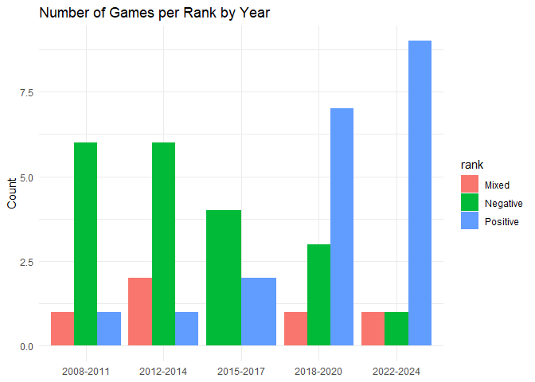
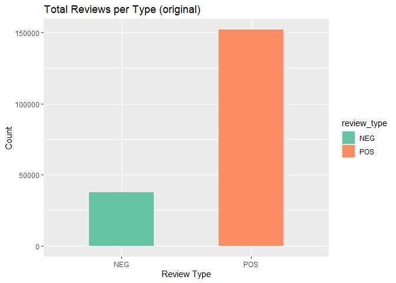
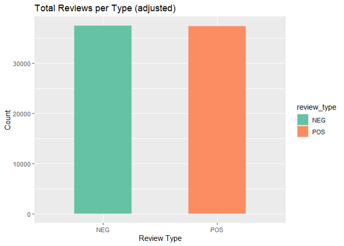
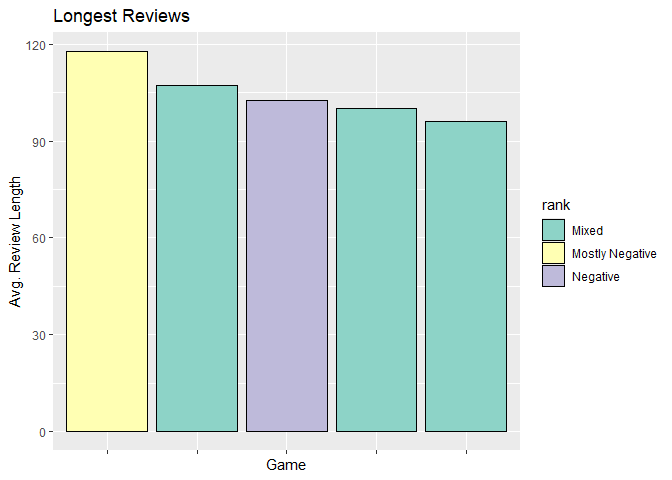
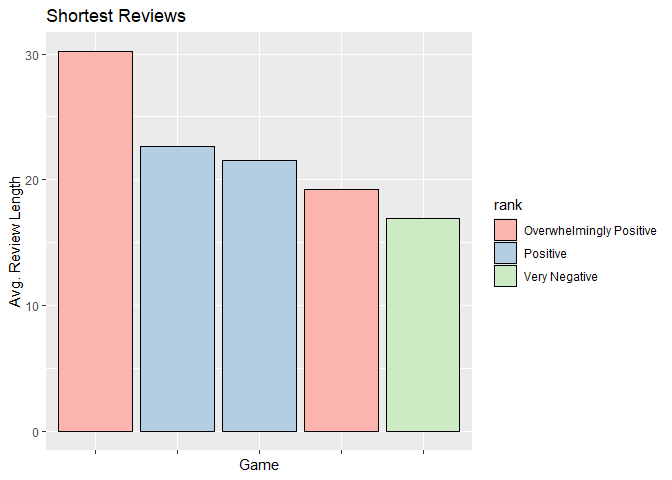
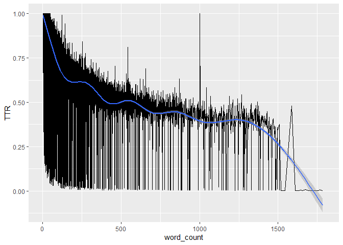

Ashley Bakaitus
Final Report
December 11, 2025

  Steam is a web application from the company Valve that functions as a storefront for video games for PC users. It hosts and sells games, has forums for user discussion or game guides, and facilitates user reviews on the various games available. The user reviews have a limit of 8,000 characters and firm guidelines of allowable content. Users can additionally, in their own settings, apply personal review filters to censor vulgar language if desired (Valve, 2025).
  
  User reviews can only have two designations, recommended (Positive) or not recommended (Negative), shown on each review in both text and marked by a thumbs up or thumbs down icon. 
  
  Written reviews for games are gathered together to calculate a game's ranking in Steam. Based on the total number of reviews and the ratio of Positive to Negative reviews, a game will fall into one of nine ranks: Overwhelmingly Positive, Very Positive, Positive, Mostly Positive, Mixed, Mostly Negative, Negative, Very Negative, or Overwhelmingly Negative. 
  
  Game reviews interested me for this project because they fall into a somewhat unique category in online writing. It's not discussion, other users can vote a review as helpful or not, but cannot reply to them. They're not professional reviews by critics that writers are paid to write. It's writing for community. Reviews are written for other users, either as warning away from a game someone won't like or an excited show of the reasons they *will* like it. 
  
  It is the internet, of course. Steam reviews aren't an exception from behavior found on websites like Reddit, message boards, or anywhere else. There are reviews that say nothing; a single long keyboard smash, ASCII art creations, or spam. Other reviews will be nothing but memes or jokes, clever at times but often not. Others want to be seen and heard by game developers directly. The majority of reviews, though, are written by and for the community of game players. 
  
  The language used in game reviews, even ones intended to be useful to other users, is not always obviously positive or negative language. Two reviews for the game *Disco Elysium* mention dying from sitting in an uncomfortable chair, one is a positive review and one is negative. Another for *Rimworld* only states "I can stop whenever I want", a review that only means anything when you see in the meta-information that the reviewer has *5,565 hours played* at the time of posting their review. 
  
  Is there a notable difference in language used in positive and negative reviews on Steam?
  
  Stepping into this, I knew I wanted to build a classifier. My hypothesis going into it was that a classifier would have some difficulty predicting if a review is *Positive* or *Negative* based on language used alone. Without the meta-review information like the thumbs up or down icon or the play time, it would be difficult with some reviews for a human reader to discern its designation! Could a classifier do any better?
  
  
  

## Data Overview

  A Reddit user in a subreddit dedicated to game developers posted about a useful tool they built to help game developers gather and summarize user feedback on games they're still working on (AlFlakky, 2024). The tool utilizes Google Sheets and downloads all reviews on a game when a unique Steam ID is entered, adding some useful summary information for languages used, number of reviews, review designation, and so on. This tool worked very well to download reviews for the games I chose to look at, but would time out after some time of running on some of the games with very many reviews. 
  
  When choosing games to analyze reviews of, I formed a set of search parameters to control the search as much as possible. Those are listed in my Repo [here](https://github.com/Data-Sci-2025/Steam-Reviews-Analysis/blob/main/notes_and_info/projnotes.md) at the bottom of the page. 
  
  These limitations could help to keep the game reviews being looked at at the same "tier" of game in regards to development and therefore user expectation. By controlling for year of release, I could assure that the games will have settled into their rankings, avoiding the fluctuation of newly released games. These parameters limited my search to 48,121 game titles.
  
  With this tool, I gathered reviews for 45 games, five games per Steam ranking mentioned above to a total of 189,298 total reviews. This broke down to 151,866 Positive reviews and 37,432 Negative reviews. The full list can be reviewed tidily [here](https://github.com/Data-Sci-2025/Steam-Reviews-Analysis/blob/main/notes_and_info/0-gameinfo.csv).
  
  The games in this analysis are from 2008-2024 (with no games from 2021).
  

  
## Data Preparation

  The data did not take much preparation to get fit for analysis. The summary details at the top of the Google Slide page created some conflicts in column classes - some of the dataframes as they were read in read a specific column as <chr> type, and others as <dbl>. This caused conflict when attempting to combine all dataframes into one large one, but was easy to fix once identified. 
  
  Some minor cleanup of the reviews themselves was needed. Anything that would not be appropriate to analyze as language was removed, meaning ASCII art and links to external pages for example. This rendered some reviews to be empty of all text, and consequently removed. 
  
  Reviews were finally tokenized with a custom set of punctuation cleanup utilized. In this way certain tokens could be preserved, like emojis. 
  
  The final necessary step in preparation was downsampling. Positively reviewed games get more total reviews than negatively reviewed games do, and many of those positively reviewed games have a 95% and higher positive review ratio, meaning that positive reviews vastly outnumbered negative reviews, making comparison difficult. 
  

  By downsampling all positive reviews proportionally, preserving the shape of the data overall, positive and negative review totals were made more equal and more easily comparable. 

## Analysis

### Review Length

  As mentioned above, reviews have a maximum of 8,000 characters, or somewhere between 1,200 to 1,600 words (Characters to Words, 2022). The reviews in the full dataset, not the downsampled version, have an average length of 51.6 words and a median of 17 words. The maximum review length is 2,182 words, much higher than the estimate given by Character Counter, but it is three short words repeated over and over "the end is". This is a mis-quote from the game the review is for: *The Stanley Parable*. 

  When split by review type, positive and negative, it's revealed that negative reviews are 33 words longer than positive reviews on average. 
  

  

  
  I believe there are several factors that are the cause of this. First, my analysis [here](https://github.com/Data-Sci-2025/Steam-Reviews-Analysis/blob/main/data_processing/2-data-analysis.md#average-review-length) shows that 74.4% of all positive reviews are 5 words or shorter. For negative reviews, this is only 38.7%. Even though all of the longest reviews (longer than 1700 words) are positive ones, with such a majority being so short, it's no surprise the average is lower. 

  Second, I suspect that Steam users have more to say when they feel negatively about a game. According to Joy Hawkins via Sterling Sky, this seems to be the case with Google reviews, at least (Hawkins, 2022). 
  

  On a closer look at the five games with the longest reviews and five games with the shortest reviews, things *mostly* align with game ranking. None of the games with the longest reviews are positively ranked, and only one of the games among the shortest reviews have been negatively ranked. It's a relatively small sample size, but it does seem that the theory that Steam users have more to say about games they dislike might have legs to stand on.
  

### Type-Token Ratio (TTR)

  TTR is a measurement of the ratio of unique words to total words for a document, in this case, in a single review. It's not an exact representation of the complexity of a document, but can be taken into consideration to indicate the variety in an author's language choices. A score of 1 indicates no repeated words in a document, and a score close to 0 indicates a highly repetitive document. A major caveat around document length to consider is described in [this](https://github.com/Data-Sci-2025/Steam-Reviews-Analysis/blob/main/data_processing/2-data-analysis.md#ttr-exploring) part of my analysis (Depala, 2023). 

  I measured TTR again using the full dataset to get the full scope of the variety of reviews. 
  

  While this plot looks crazy on its own because there are just *so* many reviews plotted, the trend line still illuminates well the difference between the very short reviews and very long ones. Based on the slope of the trend line, after the TTR is artificially inflated because of the very short reviews and before it plateaus out to a mostly flat line where function words start to catch up, I narrowed down to a length of 200 words to 600 words. 

  In the 200-600 word range, sampled so the count of positive and negative reviews is equal, the average TTR is only slightly lower in positive reviews than in negative reviews (0.01302 lower). What is interesting, though, is the difference in range of TTR per review type. Positive reviews have a difference of 0.744454 and negative reviews 0.807027. Negative reviews are more extreme on both the low and high scoring ends of TTR, indicating more variety in how repetitive (or not) negative reviews are.
  
  The average TTR for reviews in this mid-length selection is .56 and .57, a healthy indication of language variety. Rebecca Graf, a book reviewer, suggests an ideal review length of around 400 words. A little bit shorter for personal reviews or a little longer for professional, but with 400 as a safe middle ground (Graf, 2020). It's not a surprise to me that game reviews around this range have a robust TTR value. Short and varied enough to keep a reader interested but long enough to cover the key points without dragging on too long. 

### TF-IDF

  TF-DF is a measurement of word frequency in a document, and its relative weighted importance to draw meaning from any one document. Words that appear commonly in many documents are weighted as less indicative of one document type or another (articles, prepositions, and other function words for example) and words that appear less commonly are weighted as more indicative. 
  
  Starting out with simple term frequency to get a look at the most common words that appear, the table [here](https://github.com/Data-Sci-2025/Steam-Reviews-Analysis/blob/main/data_processing/2-data-analysis.md#term-frequencies) shows that the most common word in all game reviews in the downsampled dataset is the word game. 
  
  These highly common words, when split per review type, are *so* highly common that most of them appeared in the top ten frequent words for positive and negative reviews too. To get a better look at the unique most frequent words per review type, I created a custom stop words list to remove via anti_join of 35 words. Those are inspected and discussed in depth [here](https://github.com/Data-Sci-2025/Steam-Reviews-Analysis/blob/main/data_processing/2-data-analysis.md#top-words). We can see that players leaving positive reviews have different feelings about different elements of the game than ones leaving negative reviews!
  
  The TF-IDF values calculated here will be used next, in the classifier I'm building.
  
  
## The Classifier

  With the classifier as the crux of this project looking into the differences in language between positive Steam reviews and negative ones, there are some details about the shape of the data I want to address before I get into the classifier itself. 
  
  I go into this in depth at the end of the data analysis notebook [here](https://github.com/Data-Sci-2025/Steam-Reviews-Analysis/blob/main/data_processing/2-data-analysis.md#late-data-overview), but after the downsampling done to equal out the number of positive and negative reviews, a different disparity appears. There are now more *Words* total in negative reviews than in positive ones. Knowing what we do about average review length, this isn't exactly unexpected, but is important to keep in mind. After both runs of stop word removal, there are 498,153 word tokens in positive reviews, and 913,265 word tokens in negative reviews.
  
  I addressed early in my report that by language alone, the class of a review may not always be obvious even to a human audience. In order to help my classifier do the best that I could get it to do, I did some additional pre-treatment. In my dataframe, each column is one word token with the rows populated by the TF-IDF value for each word per unique review ID. First, I eliminated any column (word token) that had only one non-zero value; any word that only appears once in the data. Second, I selected an equal number of rows ranked POS and NEG as a subset of the data to put through the classifier. Finally, I filtered out any rows with a TF-IDF value less than .009, chosen because it is a bit lower than the median value of all TF-IDF values.
  
  Ultimately, I chose to use Random Forest method as a classifier model type because I read from multiple sources that RF method is good for a dataset like mine with only two class options. However, the classifier struggled to identify positive reviews in particular. The results are shown and discussed in detail [here](https://github.com/Data-Sci-2025/Steam-Reviews-Analysis/blob/main/data_processing/3-classifier.md#testing). Even when I included word count as a predicting factor along with word tokens, knowing that there is an identifiable difference in review length between classes, it didn't perform any better. 
  
  
## Conclusions

  Game reviews on Steam are worth analyzing from a linguistic perspective. With more time, I would have liked to gather more of them and analyze them in more depth and across a broader spectrum of features. At this scope, I believe I have extracted some interesting details from the reviews, though. I find it fascinating that there are some notable differences between positive reviews and negative ones. Negative reviews are longer, and not only that, but nearly three quarters all positive reviews are five words or shorter! On the other hand, it appears that much of the language actually used in reviews is not so different between the two classes. That's where I would love to dig more, to fish out exactly *where* they come to differ.

  As for the classifier, it is ultimately known that there are more word tokens that appear in the negative (NEG) review class in total. As much as I tried to control for equality throughout the process of downsampling and slicing for my classifier, it still appeared to overfit to NEG class, over-predicting NEG for the vast majority of reviews. My hope would be that with some additional work and additional features, I could build a better classifier.
  
## Project History

  Overall, I felt lucky that my data gathering was quite easy! The tool found on Reddit was nice to use and convenient, but a lot of the data prep and cleaning was the toughest part, no surprise. Building one full dataframe while preserving the individual game ID numbers was the first major test of my coding skills, and after that, wrestling with emojis was the second biggest test. I still wish I had gotten them working cleanly and could have included them in more of my analysis. I found myself pivoting from my original plan early on, thinking initially about classifying for *game rank* and switching to *review type* felt like a natural conclusion as I thought through which of the two had more linguistic basis. With game rank coming down to a ratio of positive/negative reviews, there's not much language basis in there. Though a cool next step if my review type classifier had been a success, would be to use those classified reviews to then additionally attempt to predict a game's Steam ranking. The frequent hurdles I ran into while working on this project typically came down to my coding abilities, but were a (usually) fun challenge to figure out when it did come up.

## Resources

Valve. “Steam Support :: Rules and Guidelines for Steam: Discussions, Reviews, and User Generated Content.” Help.steampowered.com, 2025, help.steampowered.com/en/faqs/view/6862-8119-C23E-EA7B.

AlFlakky. “I Made a Tool That Allows Developers to Download Reviews of Steam Games and Analyze Them.” Reddit, 2024, www.reddit.com/r/gamedev/comments/1dpxwrp/i_made_a_tool_that_allows_developers_to_download/. Accessed 12 Dec. 2025.

“Characters to Words Calculator.” Charactercounter.com, 2022, charactercounter.com/characters-to-words. 

Hawkins, Joy. “Does the Length of a Google Review Matter?” Sterling Sky Inc, 28 Nov. 2022, www.sterlingsky.ca/length-google-review-matter/. Accessed 12 Dec. 2025.

Depala, Rajeswari. “Type Token Ratio in NLP.” Medium, 31 Aug. 2023, medium.com/@rajeswaridepala/empirical-laws-ttr-cc9f826d304d.

Graf, Rebecca. “How Long Should Book Reviews Be?” Medium, 15 June 2020, rebeccagraf-63084.medium.com/how-long-should-book-reviews-be-250187486779.
